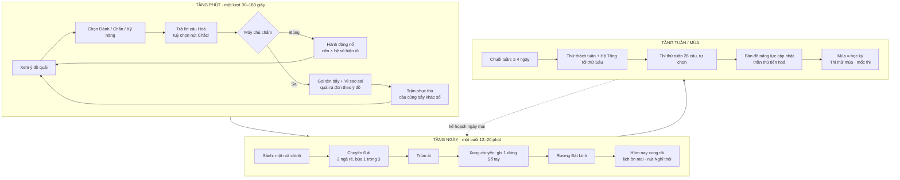

# TÀI LIỆU THIẾT KẾ GAME (GDD) — BÁT LINH

*App học Hoá THPT dạng game · web + web app (PWA), không lên cửa hàng · bản 1.0 ngày 01/10/2026*
*Đối chiếu mã tại `origin/main`. Tài liệu chỉ đọc repo, không sửa mã.*

> **Cách đọc số liệu.** Mọi con số game trong tài liệu (máu, sát thương, vàng, giá, ngưỡng) là **số ban đầu, cân bằng sau thử**. Số có sẵn trong mã thì ghi tên hằng số và tệp. Số lấy từ nghiên cứu thì ghi nguồn. Chỗ nào chỉ là giả thuyết thì ghi rõ "giả thuyết".

---

## 0. Phạm vi nguồn

**Repo đã đọc (qua `git show origin/main:<tệp>`):**
`docs/hop-dong-game-hoa-2.md`, `src/components/hoa2/SanhBanDo.tsx` (đầu tệp), `src/game/than-thu-v2/dao2/dao2-core.ts`, `src/game/than-thu-v2/doan-core.ts` (hằng số, kiểu dữ liệu), `src/game/than-thu-v2/learning-battle.ts`, `src/game/than-thu-v2/evolution.ts`, `src/game/bi-a/luat.ts`, `src/game/bi-a/nguyen-to.ts`, `server/src/srs2-loi.ts` (hằng số, `phatLaiCau`, hạng theo dạng), `src/components/loi-giai/KhungLoiGiai.tsx`, `src/components/tu-luyen/ManTuLuyen.tsx`, `src/lib/tu-luyen.ts`, danh sách tệp `public/than-thu-v2/`.
Đầu vào: báo cáo `nghien-cuu-game-luot-0110.md` (6 đề xuất Đ1–Đ6, vòng một buổi, 10 điều không làm) và `DE-XUAT-HOAN-CHINH-0110.md`.

**Nghiên cứu bổ sung:** chỉ đọc được **trích đoạn kết quả WebSearch** (01/10/2026). WebFetch bị proxy chặn (thử lại hôm nay: `nature.com`, `mobilegamer.biz` đều trả `EGRESS_BLOCKED`). Vì vậy:
- Mọi câu "theo nguồn X" nghĩa là theo trích đoạn của X trong kết quả tìm kiếm, chưa đọc toàn văn.
- Một số con số xuất hiện trong trích đoạn nhưng đến từ trang thứ cấp hoặc trang của bên bán dịch vụ (ví dụ "chuỗi Duolingo nâng giữ chân từ 12% lên 55%", "66% người chơi Candy Crush ở lại hơn 3 năm"). Các số này **ghi ra để cảnh giác, không dùng làm căn cứ thiết kế**.
- Danh mục URL ở mục 13.

---

## 1. Tầm nhìn, trụ cột, điều không làm

### 1.1 Tầm nhìn (một đoạn)

Bát Linh là một quần đảo bị **Mê Vụ**, màn sương sinh ra từ những hiểu nhầm, phủ kín. Mỗi hiểu nhầm phổ biến của Hoá THPT hoá thành một con quái có tên. Học sinh lớp 10–12 tự đăng ký, làm một chuyến thám hiểm đầu vào khoảng 15–20 phút, rồi nhận một thần thú đồng hành và một bản đồ năng lực của riêng mình. Mỗi ngày em ra đảo một buổi 12–20 phút: đánh quái bằng câu Hoá thật, gọi đúng tên cái bẫy mình vừa dính, phục thù nó ngay trong chuyến, rồi dừng ở một điểm dừng rõ ràng. Máy tự chọn câu theo lịch ôn cách quãng và năng lực từng dạng, nên ngày nào em cũng tiến một chút và thấy được mình tiến ở đâu. Thầy chỉ cần cập nhật kho đề. App chạy mượt trên máy yếu, không bán gì cho học sinh, và không dùng sợ hãi để giữ chân.

### 1.2 Ba trụ cột trải nghiệm

| Trụ cột | Em cảm thấy | Cơ chế chính | Đo bằng |
|---|---|---|---|
| **T1. Hiểu thì thắng** | "Mình thắng vì mình hiểu, thua thì biết vì sao" | Ý đồ địch hiện rõ; sát thương = nền × hệ số hiện rõ; bẫy có tên; trận phục thù | Tỉ lệ **tự sửa lỗi** (sai → đúng ở lần gặp lại, không gợi ý) |
| **T2. Mỗi ngày một bước** | "Hôm nay xong rồi, mai thần thú hẹn mình 2 câu" | Buổi 12–20 phút có điểm dừng; SRS; chuỗi tuần khoan dung; quay lại không bị phạt | **Nhớ sau trễ** (đúng ở lần ôn cách ≥ 7 ngày); **ngày quay lại học**/tuần |
| **T3. Thế giới của em** | "Thần thú của mình, Sổ tay của mình, đảo của mình" | Thần thú 8 hệ tiến hoá theo năng lực thật; Sổ tay bẫy sưu tầm; Vườn Linh trang trí; Hộ Tống cùng bạn | Tỉ lệ em có hoạt động ngoài trận (sổ tay, vườn, đội); khảo sát 3 câu |

### 1.3 Điều KHÔNG làm (bất biến, mọi giai đoạn)

| # | Không làm | Lý do |
|---|---|---|
| K1 | **Gacha, rương may rủi, bán bất cứ thứ gì bằng tiền thật trong app học sinh** (vàng, EXP, thần thú, lượt, hồi sinh) | Liên hệ giữa rương may rủi và cờ bạc có vấn đề (Zendle & Cairns 2018, DOI 10.1371/journal.pone.0206767). Người dùng 15–18 tuổi |
| K2 | **Phạt chuỗi nặng, thông báo doạ** ("Thần thú buồn vì em bỏ học") | Mất chuỗi dễ dẫn đến bỏ hẳn; ngay Duolingo cũng phải thêm bùa đóng băng chuỗi (blog.duolingo.com; lennysnewsletter.com) |
| K3 | **Ép giờ phản xạ**, QTE, đồng hồ đếm ngược gắt trong trận | Máy yếu; phản xạ không đo năng lực Hoá. Chỉ giữ **hạn mềm** theo độ dài câu (Bi-a: Phần I 90 giây, Phần II/III 180 giây, `giayCau` trong `bi-a/luat.ts`). Ngoại lệ duy nhất: **Thi thử** 50 phút, em tự chọn vào, ghi rõ là mô phỏng phòng thi |
| K4 | **Lộ đáp án trước khi nộp** | Đáp án không xuống máy học sinh trước khi nộp (luật repo). Ý đồ địch chỉ dùng số quái, số ý; mã bẫy chỉ hiện **sau** khi máy chủ chấm |
| K5 | **Bảng xếp hạng công khai làm xấu hổ** | So sánh xã hội làm giảm cảm giác năng lực ở nhóm yếu (SDT). Chỉ so với chính em tuần trước, hoặc kết quả chung của đội |
| K6 | **Rút câu tự luận vào kênh tự động** | Luật repo, dùng `src/lib/cau-tu-luan.ts`; máy chủ đã bỏ câu tự luận khỏi kế hoạch (`MetaCau.tuLuan`) |
| K7 | **Mặt "black hat" của Octalysis**: khan hiếm giả (đồ chỉ bán 24 giờ), bất ngờ kiểu máy đánh bạc, sợ mất mát | Gây lo âu, cảm giác bị thao túng (yukaichou.com, bài White Hat vs Black Hat) |
| K8 | **"Gần thắng" để bán lượt** (kiểu Royal Match bán thêm nước đi) | Phân tích của Playliner nói Royal Match thiết kế màn để tạo nhiều khoảnh khắc "suýt thua" rồi bán thêm lượt. App chỉ dùng "gần thắng" để **mời gỡ bằng một câu học**, không bao giờ bán |
| K9 | **Reset làm mất tiến bộ** (bài học Civilization VII) | Bẫy đã thuần phục, Sổ tay, thần thú, Vườn Linh giữ vĩnh viễn qua mùa |
| K10 | **EXP cho Tu luyện**; quảng cáo; bán dữ liệu học sinh | Giữ luật hiện tại (`ManTuLuyen`: "không tính EXP") |

---

## 2. Nghiên cứu bổ sung: em mê vì đâu

### 2.1 Bài học từ game và ứng dụng ngoài thể loại theo lượt

Bảng này bổ sung cho 15 game theo lượt trong báo cáo `nghien-cuu-game-luot-0110.md`.

| Game/ứng dụng | Điều trích đoạn nói (nguồn) | Lấy gì cho Bát Linh | Không lấy |
|---|---|---|---|
| **Duolingo** | Đội Retention đã chạy hơn 600 thí nghiệm về chuỗi ngày trong 4 năm; năm 2024 cho giữ tối đa 2 bùa đóng băng chuỗi (lennysnewsletter.com/p/behind-the-product-duolingo-streaks). Blog Duolingo: bùa nghỉ cuối tuần (blog.duolingo.com) | Chuỗi khoan dung, bài học ngắn, nhắc ôn | Chuỗi doạ, "cược chuỗi" (Streak Wager), bảng xếp hạng giải đấu công khai |
| **Pokémon GO** | Chơi gắn với nhiều tương tác hơn với bạn bè và người lạ, tăng động lực khám phá xung quanh, giảm cô đơn ở một số nhóm (tổng quan hệ thống PMC8123321; JMIR scoping review doi 10.2196/89235) | Sưu tầm có ý nghĩa (Sổ tay bẫy như một bộ sưu tập), sự kiện cộng đồng nhẹ | Định vị GPS, khan hiếm theo nơi |
| **Stardew Valley** | Một ngày trong game dài khoảng 20 phút, lưu khi hết ngày nên tự kết thúc một vòng; không ép cách "thắng" (medium.com/swlh/deceptively-simple-design) | Buổi có điểm dừng tự nhiên; nhiều mục tiêu song song do em tự chọn | Lịch mùa vụ ép |
| **Animal Crossing: NH** | Chạy theo giờ thật; nâng nhà, xây công trình phải chờ 1–2 ngày thật, nên chơi theo "từng đợt ngắn mỗi ngày" (gamedeveloper.com; byte-sized-brainz.humspace.ucla.edu) | Vườn Linh riêng, đồ trang trí, ngày/đêm theo giờ thật, công trình "xây qua đêm" | Bán đồ bằng tiền thật |
| **Genshin Impact** (chỉ thế giới) | Mỗi vùng gắn một nguyên tố, ảnh hưởng quái, câu đố, địa hình; sương mù bản đồ tan khi tới nơi (getworld.co.uk; exitlag.com) | **Mỗi đảo một chương**, mỗi đảo một "chất" riêng; sương Mê Vụ tan theo năng lực | **Gacha** (K1) |
| **Clash Royale / Brawl Stars** | Trận Clash Royale 3 phút, thêm 1 phút nếu hoà, vừa một lần chờ xe (clashroyale.wiki; deconstructoroffun.com). Brawl Stars từng dùng Starr Road: lộ trình mở khoá tuyến tính thay hộp may rủi; 09/2026 đổi sang "Brawler Blast" thêm ngẫu nhiên (timesaver.gg) | Trận ngắn có độ dài cố định; mở khoá **tuyến tính, đoán trước được** | Rương hẹn giờ kéo em quay lại nhiều lần/ngày; mở khoá ngẫu nhiên |
| **Royal Match / Candy Crush** | King dùng số liệu để điều chỉnh độ khó từng màn; thử A/B thấy làm màn khó hơn tăng chuyển đổi ngắn hạn, nhưng làm dễ hơn giữ người chơi lâu hơn (robguilar.com; business.columbia.edu). Royal Match có nhiều khoảnh khắc "suýt thua" hơn đối thủ (playliner.com, phân tích của bên thứ ba) | Độ khó theo màn có số liệu; cắt màn gây bỏ cuộc; ưu tiên **giữ chân dài hạn hơn ngắn hạn** | Bán lượt khi gần thua (K8) |
| **Balatro** | Combo nhân số; chạy ngắn, dễ đọc, có khả năng lật ngược (shacknews.com) | Công thức `nền × hệ số` hiện rõ, juice nhẹ | Vỏ cờ bạc |
| **Slay the Spire 2** | Co-op 4 người: mỗi người bộ bài riêng, trận chung; quái mạnh lên theo số người; được hồi máu cho đồng đội, chia giáp (pcgamesn.com; gamespot.com; Wikipedia qua trích đoạn) | Ý đồ địch; bản đồ rẽ; chọn 1 trong 3; **co-op chia giáp** cho Hộ Tống | Chuyến 45–90 phút |
| **Wordle** | Mỗi ngày một câu đố chung cho mọi người; nút chia sẻ ô màu **không lộ đáp án**; người chơi tăng từ ~90 lên ~300.000 trong 2 tháng nhờ chia sẻ (wikipedia; x.com/powerlanguish) | **Câu Hoá chung của ngày** + thẻ chia sẻ không lộ đáp án | — |
| **Minecraft (Education)** | Tổng quan hệ thống ghi tác động tích cực lên sáng tạo, hợp tác, tư duy phản biện (Slattery 2025, Review of Education, doi 10.1002/rev3.70035) | Không gian tự do sáng tạo (Vườn Linh); "Phòng thí nghiệm" tự lắp | Thế giới mở nặng máy |
| **Among Us** | Quick Chat ra mắt 03/2021: nhắn bằng mẫu câu soạn sẵn, "nhanh hơn và an toàn hơn"; mở chat tự do khi xác nhận ≥ 13 tuổi (internetmatters.org; among-us.fandom.com) | **Chỉ chat bằng mẫu câu** trong Hộ Tống/Song đấu | Chat tự do với người lạ |
| **Khan Academy** | Mỗi kỹ năng 100 điểm thành thạo: Familiar 50, Proficient 80, Mastered 100. Mastery Challenge luôn gồm 6 câu ôn 3 kỹ năng, cá nhân hoá, ôn cách quãng. Muốn Mastered phải chứng minh nhiều lần, lần cuối ở bài kiểm tra (support.khanacademy.org) | Thang năng lực theo dạng; "thành thạo" phải qua lần ôn sau | — |
| **Brilliant** | Cho người học **thử giải trước** rồi mới dạy cách làm; tương tác, trực quan (wowmath.org; play.google.com) | Mở đảo mới bằng **câu thử** trước, bài mẫu sau | Gói trả phí trong app học sinh |

### 2.2 Khung động cơ người chơi

**Quantic Foundry: 12 động cơ, 6 nhóm** (quanticfoundry.com; medium.com/ironsource-levelup). Hành động (Phá huỷ, Hồi hộp); Xã hội (Thi đua, Cộng đồng); Làm chủ (Thử thách, Chiến lược); Thành tựu (Hoàn thành, Sức mạnh); Nhập vai (Tưởng tượng, Câu chuyện); Sáng tạo (Thiết kế, Khám phá). Trích đoạn cho biết dữ liệu mới nhất gồm hơn 466.000 người chơi 13–64 tuổi (01/2023–04/2025), và động cơ "Phá huỷ" mạnh nhất ở nam dưới 18 tuổi.

**Self-Determination Theory (SDT).** Ba nhu cầu: tự chủ, năng lực, gắn kết. Meta-analysis trên Educational Technology Research and Development (link.springer.com/article/10.1007/s11423-023-10337-7) theo trích đoạn: gamification tăng động lực nội tại, cảm nhận tự chủ và gắn kết, nhưng **tác động lên cảm nhận năng lực rất nhỏ**. Hệ quả cho thiết kế: cảm giác năng lực phải đến từ **chứng cứ học thật** (tự sửa được lỗi, nhớ sau trễ), không đến từ huy hiệu.

**Flow (Csikszentmihalyi).** Ba điều kiện chính: mục tiêu rõ, phản hồi tức thì, thử thách cân với kỹ năng (yukaichou.com/gamification-analysis/flow-theory…; positivepsychology.com).

**Octalysis (Yu-kai Chou), 8 động lực lõi.** **Chỉ dùng mặt "white hat"**: (1) Ý nghĩa lớn, (2) Phát triển & thành tựu, (3) Sáng tạo & phản hồi, cộng thêm (4) Sở hữu và (5) Xã hội ở mức lành mạnh. **Không dùng mặt "black hat"**: (6) Khan hiếm & nóng lòng, (7) Bất ngờ kiểu may rủi, (8) Sợ mất mát. Nguồn: yukaichou.com/gamification-study/white-hat-black-hat-gamification-octalysis-framework/. Riêng (7) Tò mò: chỉ dùng dạng **khám phá có quyền chọn** (chọn 1 trong 3, góc đảo ẩn), không dùng phần thưởng ngẫu nhiên.

**Vùng vừa sức.** Wilson, Shenhav, Straccia & Cohen 2019, *Nature Communications*, "The Eighty Five Percent Rule for optimal learning" (nature.com/articles/s41467-019-12552-4): với tác vụ phân loại hai lựa chọn học bằng gradient, tỉ lệ lỗi tối ưu khoảng 15,87%, tức đúng khoảng 85%. **Giới hạn:** kết quả từ mô hình máy học và tác vụ hai lựa chọn. Áp dụng cho câu Hoá nhiều bước chỉ là **giả thuyết làm việc**. Vì vậy app đặt **dải mục tiêu 70–85% đúng** và hiệu chỉnh bằng số liệu thật (mục 7.3).

**Kiểu người chơi thích ứng.** Có nghiên cứu "adaptive gamification" chỉnh yếu tố game theo hồ sơ người chơi (Bartle, Hexad; journals.sagepub.com/doi/10.1177/21582440251377738). Trích đoạn không cho thấy hiệu quả vượt trội ổn định. Bát Linh coi việc này là **giả thuyết cần thử**.

### 2.3 Tám kiểu học sinh và điều mỗi kiểu nhận được

**Nói thẳng: không thiết kế nào bảo đảm 100% em mê.** Có em không thích game, có em chỉ cần luyện đề. Mục tiêu là **mọi em đều có ít nhất một lối đi hợp mình**, và lối học lõi (kế hoạch ngày) **không phụ thuộc** em có thích phần game hay không. Em nào không thích có thể bật **Chế độ gọn** (mục 6.10): chỉ còn câu hỏi, lời giải, lịch ôn.

| Kiểu (động cơ Quantic gần nhất) | Em này thích | Trong Bát Linh, nổi bật với em | Tín hiệu hành vi để nhận ra |
|---|---|---|---|
| **Thành tựu** (Hoàn thành, Sức mạnh) | Thanh tiến độ đầy, mốc, cấp | Thần thú tiến hoá, bản đồ năng lực lên màu, mốc tuần | Mở màn Thành tích; tỉ lệ làm hết kế hoạch; chọn Tinh anh |
| **Khám phá** (Khám phá) | Chỗ mới, bí mật | Sương Mê Vụ tan, góc đảo ẩn, đảo mới | Bấm vào vùng chưa mở; vào đảo chương chưa học; xem "Vì sao" kể cả câu đúng |
| **Sưu tầm** (Hoàn thành) | Bộ sưu tập đầy đủ | **Sổ tay bẫy**, thẻ quái, bộ đồ Vườn Linh | Mở Sổ tay bẫy; xem chi tiết thẻ; phục thù bẫy cũ tự nguyện |
| **Câu chuyện** (Câu chuyện, Tưởng tượng) | Nhân vật, lời thoại | Hồi truyện mỗi đảo; thần thú nói về lỗi em vừa sửa | Thời gian ở màn thoại; ít bấm "Bỏ qua" |
| **Xã hội/hợp tác** (Cộng đồng) | Làm cùng bạn | Đoàn Hộ Tống, tiếp sức, mục tiêu chung của lớp | Số lần vào Hộ Tống; tiếp sức bạn |
| **Thi đua nhẹ** (Thi đua, Thử thách) | Đấu, so tài | Bi-a đối kháng, Song đấu bẫy, Thử thách tuần | Vào Bi-a online, Song đấu; làm lại Thử thách để tăng điểm |
| **Sáng tạo** (Thiết kế) | Tự bày, tự làm | Vườn Linh, phối đồ thần thú, tự viết "câu thần chú" trong Sổ tay | Thời gian ở Vườn Linh; số lần sắp đồ; độ dài câu thần chú |
| **Chơi nhanh rảnh tay** (Hồi hộp) | Phiên ngắn, vào là chơi | Chuyến 3 ải "Ghé nhanh", Câu chung của ngày | Phiên dưới 6 phút; nhiều phiên ngắn mỗi ngày; mở từ thông báo |

Cách nhận ra kiểu từ hành vi và đổi điểm nhấn: mục 7.5.

---

## 3. Thế giới và câu chuyện

### 3.1 Bối cảnh

Quần đảo **Bát Linh** từng được tám linh thú canh giữ cuốn **Nguyên Tố Thư**, cuốn sách ghi lại cách vạn vật biến đổi. Một đêm cuốn sách bị xé tung. Những trang giấy rơi xuống biển, mỗi trang thành một hòn đảo. Chỗ chữ bị nhoè sinh ra **Mê Vụ**, màn sương của những hiểu nhầm, và từ sương mọc lên quái. Quái không ác. Chúng chỉ **tin sai**: con thì tin Fe luôn lên hoá trị III, con thì tin HF là acid mạnh nhất. Muốn quái tan, phải **chỉ đúng chỗ nó sai**.

Em là **Người Giữ Sổ**. Em được một linh thú chọn làm bạn đồng hành. Việc của em: đi qua từng đảo, gọi tên từng hiểu nhầm, ghi nó vào **Sổ tay bẫy**, ghép lại Nguyên Tố Thư.

### 3.2 Cốt truyện mở dần (ngắn, không cảnh dựng dài)

Nguyên tắc: mỗi đoạn truyện tối đa **3 khung thoại × 2 câu**. Luôn có nút **"Bỏ qua"**. Đoạn truyện chỉ hiện ở **đầu hoặc cuối** buổi, không chen giữa câu hỏi. Chữ dựng bằng mã, ảnh nhân vật dùng bộ có sẵn.

| Hồi | Mở khi | Nội dung (tóm tắt) |
|---|---|---|
| Mở màn | Vào app lần đầu | Thần thú tỉnh dậy trên Đảo Thức Tỉnh, sương phủ kín. "Cùng tớ đi một vòng xem em đã biết những gì nhé." Mở đầu bài đầu vào (mục 5) |
| Hồi 1: Trang Nền Tảng | Xong bài đầu vào | Bản đồ năng lực hiện ra thành 8 đền. Sương tan ở những đền em đã vững. Lộ ra Quần đảo Khởi Nguyên (lớp 10) |
| Hồi 2: Trang Biến Hoá | Thuần phục được 10 bẫy, hoặc em là học sinh lớp 11 trở lên | Phát hiện quái mạnh lên khi các hiểu nhầm **dính chùm** (ví dụ dính bẫy cân bằng oxi hoá–khử nên tính sai luôn khí sinh ra). Mở Quần đảo Biến Hoá |
| Hồi 3: Trang Kiến Tạo | Mở Quần đảo Kiến Tạo (lớp 12) | Kim loại, polymer, pin. Gặp **Mê Vụ Vương**, kẻ gom mọi hiểu nhầm lại thành một đề thi giả |
| Hồi mùa | Mỗi mùa (học kỳ) | Một trang "mất tích" mới (sự kiện mùa), kết thúc bằng **Thi thử mùa** đánh Mê Vụ Vương |
| Kết lớp 12 | Sau mốc thi tốt nghiệp | Nguyên Tố Thư ghép xong trang của em. Thần thú ở lại Vườn Linh. Hồ sơ năng lực tải về được |

Thần thú nói **một câu sau mỗi buổi**, và câu đó phải nhắc **lỗi cụ thể em vừa sửa**, ví dụ "Hôm nay cậu bắt được Bẫy Fe hoá trị III rồi đó! Mai tớ hẹn cậu gặp lại nó một lần nữa." Không dùng câu sáo rỗng, không doạ.

### 3.3 Tám thần thú đồng hành (giữ bộ hiện có)

Lấy từ `BATTLE_SKINS` trong `src/game/than-thu-v2/learning-battle.ts`. Ảnh có sẵn: `public/than-thu-v2/nho/thu-<0..7>-<0..5>` (6 bậc tiến hoá mỗi con, có bản "-be"), thẻ `the-<0..7>-binh-thuong|cuong-no`, ảnh trận `combat/0..7`, atlas tiến hoá `evolution-elements-cutout` (con 0–3) và `evolution-virtues-cutout` (con 4–7). Tên bậc tiến hoá (`evolution.ts`): Ấu thú, Thức tỉnh, Trưởng thành, Linh giáp, Thăng hoa, Thần hộ mệnh.

| # | Thần thú | Chiêu (`move`) | Kỹ năng Hộ Tống / bản Ấn | Nhóm (`NHOM`) | Mạch Hoá thần thú "canh giữ" (chỉ là vỏ truyện) |
|---|---|---|---|---|---|
| 0 | **Thạch Quy** | Địa Tinh Pháo | Địa Tinh Thuẫn / Địa Tinh Trấn Sơn | thủ | Kim loại (đại cương, IA–IIA, chuyển tiếp) |
| 1 | **Thuỷ Long** | Thuỷ Long Pháo | Dòng Nước Tiếp Sức / Băng Long Trảo | hồi | Hữu cơ lớp 12 (ester, carbohydrate, nitrogen hữu cơ, polymer) |
| 2 | **Viêm Sư** | Liệt Diễm Pháo | Liệt Diễm / Liệt Diễm Xuyên Giáp | công | Phản ứng: năng lượng, tốc độ, cân bằng |
| 3 | **Phong Thố** | Phong Luân Kích | Phong Bộ / Phong Bộ Cuồng Lốc | công | Phi kim: halogen, nitrogen, sulfur |
| 4 | **Tinh Lang** | Tinh Quang Pháo | Tinh Quang Liên Kết / Tinh Quang Thiên Võng | thủ | Nguyên tử, bảng tuần hoàn, liên kết |
| 5 | **Ái Hồ** | Ái Tâm Quang | Ái Tâm Hồi Phục / Ái Tâm Trường Xuân | hồi | Dẫn xuất: halogen, alcohol, phenol, carbonyl, acid |
| 6 | **Ân Lộc** | Ân Hoa Quang | Vườn Ân Lộc / Ân Lộc Mãn Khai | hồi | Hữu cơ đại cương và hydrocarbon |
| 7 | **Minh Linh** | Minh Tâm Quang | Minh Quang / Minh Quang Phá Ám | công | Oxi hoá–khử và điện hoá (pin, điện phân) |

**Luật quan trọng:** thần thú **không cho chỉ số** trong trận (giữ luật `GheDoan` hiện tại: "Ghế KHÔNG có cấp thần thú"). Chọn con nào cũng công bằng. Mạch "canh giữ" chỉ đổi lời thoại và màu đền trong bản đồ năng lực, để em chọn theo sở thích mà không sợ chọn sai.

### 3.4 Ba quần đảo, 21 đảo theo chương trình Hoá 2018

Chương lấy theo bộ sách "Kết nối tri thức" (bộ khác có thể đổi thứ tự, nhưng nội dung cốt lõi theo chương trình 2018 giống nhau: hoatieu.vn, dtbdtx.hnue.edu.vn). Mỗi đảo có **một quái đầu đàn gắn một bẫy phổ biến** và một **trùm đảo**. Mọi ví dụ dưới đây đã tự kiểm số. Thể tích khí ở **điều kiện chuẩn (đkc) 24,79 L/mol**. Nguyên tử khối: H 1, C 12, N 14, O 16, Na 23, Cl 35,5, Fe 56, Cu 64, Ag 108, Br 80.

**Quần đảo Khởi Nguyên (lớp 10)**

| Đảo (chương) | Quái gắn bẫy | Ví dụ thật (đáp án đúng · phương án bẫy) | Trùm đảo |
|---|---|---|---|
| 1. **Đảo Hạt Nhân** (Cấu tạo nguyên tử) | Ma Quên Trừ Electron | Ion ²⁷₁₃Al³⁺ có p = 13, n = 27 − 13 = **14**, e = 13 − 3 = **10** · bẫy: e = 13 | Bóng Ma Proton |
| 2. **Đảo Tuần Hoàn** (Bảng tuần hoàn) | Thằn Lằn Bán Kính | Na, Mg, Al cùng chu kỳ 3, Z tăng thì bán kính **giảm**: Na > Mg > Al · bẫy: "Al lớn nhất vì Z lớn nhất" | Tuần Hoàn Ảo Ảnh |
| 3. **Đảo Liên Kết** (Liên kết hoá học) | Rắn Hai Cực | CO₂ có liên kết C=O phân cực nhưng phân tử thẳng nên **không phân cực**; H₂O phân tử góc nên phân cực · bẫy: "liên kết phân cực thì phân tử phân cực" | Mạng Lưới Đứt |
| 4. **Đảo Oxi Hoá – Khử** (Phản ứng oxi hoá – khử) | Cua Đếm Nhầm | Fe + 4HNO₃(loãng) → Fe(NO₃)₃ + NO + 2H₂O: chỉ **1** trong 4 phân tử HNO₃ là chất oxi hoá, 3 phân tử làm môi trường · bẫy: 4 | Song Diện Electron |
| 5. **Đảo Năng Lượng** (Năng lượng hoá học) | Đom Đóm Đảo Dấu | H₂ + Cl₂ → 2HCl; Eb(H–H) 436, Eb(Cl–Cl) 243, Eb(H–Cl) 432 kJ/mol. ΔrH = Σ Eb(chất đầu) − Σ Eb(sản phẩm) = 679 − 864 = **−185 kJ** · bẫy: +185 (lấy sản phẩm trừ chất đầu như khi dùng nhiệt tạo thành) | Lò Enthalpy |
| 6. **Đảo Tốc Độ** (Tốc độ phản ứng) | Thỏ Cộng Dồn | Hệ số nhiệt độ γ = 2, tăng 30 °C → 60 °C: tốc độ tăng 2^((60−30)/10) = 2³ = **8 lần** · bẫy: 6 lần (2 × 3) | Đồng Hồ Xúc Tác |
| 7. **Đảo Halogen** (Nhóm VIIA) | Sói Âm Điện | Tính acid HF < HCl < HBr < HI; HF là acid **yếu** · bẫy: "HF mạnh nhất vì F âm điện nhất" | Nữ Hoàng Clo |

**Quần đảo Biến Hoá (lớp 11)**

| Đảo (chương) | Quái gắn bẫy | Ví dụ thật | Trùm đảo |
|---|---|---|---|
| 8. **Đảo Cân Bằng** (Cân bằng hoá học, pH) | Sứa Pha Loãng | Dung dịch HCl pH = 2 pha loãng 10 lần: [H⁺] = 10⁻³ M, pH = **3** · bẫy: pH = 0,2 (chia pH cho 10). Kèm: CaCO₃(s) ⇌ CaO(s) + CO₂(g) có Kc = **[CO₂]**, chất rắn không có mặt | Thăng Bằng Vương |
| 9. **Đảo Nitrogen – Sulfur** | Rồng Khói Nâu | 3Cu + 8HNO₃(loãng) → 3Cu(NO₃)₂ + 2NO + 4H₂O. 19,2 g Cu = 0,3 mol → n(NO) = 0,2 mol → V = **4,958 L** · bẫy: 7,437 L (cho n(NO) = n(Cu)). Kèm: Fe, Al thụ động trong HNO₃ đặc nguội, H₂SO₄ đặc nguội | Long Vương Sulfur |
| 10. **Đảo Hữu Cơ Đại Cương** | Bóng Đồng Phân | C₄H₁₀O có **7** đồng phân cấu tạo: 4 alcohol + 3 ether · bẫy: 4 (quên ether) | Mê Cung Mạch Carbon |
| 11. **Đảo Hydrocarbon** | Rết Liên Ba | 0,1 mol propyne cộng tối đa 0,2 mol Br₂ = **32 g** · bẫy: 16 g (coi như alkene). Kèm: benzene không làm mất màu nước bromine ở điều kiện thường | Vương Miện Benzene |
| 12. **Đảo Alcohol – Phenol** (Dẫn xuất halogen – alcohol – phenol) | Cáo Một Brom | 9,4 g phenol (0,1 mol) + nước bromine dư → 0,1 mol 2,4,6-tribromophenol (M = 331) = **33,1 g** kết tủa trắng · bẫy: 17,3 g (thế 1 Br, M = 173) | Pháp Sư Glycerol |
| 13. **Đảo Carbonyl – Acid** (Hợp chất carbonyl – carboxylic acid) | Quạ Bạc Đôi | 0,1 mol HCHO + AgNO₃/NH₃ dư → **0,4 mol Ag = 43,2 g** · bẫy: 21,6 g (coi HCHO như aldehyde thường, 1 : 2) | Chúa Tể Gương Bạc |

**Quần đảo Kiến Tạo (lớp 12)**

| Đảo (chương) | Quái gắn bẫy | Ví dụ thật | Trùm đảo |
|---|---|---|---|
| 14. **Đảo Ester – Lipid** | Ốc Phenyl | 13,6 g phenyl acetate CH₃COOC₆H₅ (M = 136, 0,1 mol) + NaOH vừa đủ: cần **0,2 mol = 8 g NaOH** (tạo CH₃COONa + C₆H₅ONa + H₂O) · bẫy: 4 g | Hoàng Hậu Xà Phòng |
| 15. **Đảo Carbohydrate** | Ong Đường Mía | 18 g glucose (0,1 mol) tráng bạc → **0,2 mol Ag = 21,6 g**; saccharose **không** tráng bạc · bẫy: "saccharose cũng cho Ag" | Cây Tinh Bột Cổ |
| 16. **Đảo Nitrogen Hữu Cơ** (Amine, amino acid, peptide, protein) | Chuỗi Peptide Lạc | Ala-Gly-Ala có **2** liên kết peptide (n − 1) · bẫy: 3. Kèm: 7,5 g glycine (0,1 mol) + HCl vừa đủ → **11,15 g** muối (M = 111,5) | Đại Pháp Sư Protein |
| 17. **Đảo Polymer** | Nhện Trùng Hợp | PVC (mắt xích M = 62,5) có M = 125.000 → hệ số polymer hoá **2.000** · bẫy: "nylon-6,6 điều chế bằng trùng hợp" (đúng là **trùng ngưng**) | Tơ Tằm Vương |
| 18. **Đảo Điện Hoá** (Pin điện và điện phân) | Đom Đóm Cộng Thế | Pin Zn–Cu: E°pin = 0,34 − (−0,76) = **1,10 V** · bẫy: −0,42 V. Kèm: điện phân CuSO₄, I = 2 A, t = 965 s → q = 1.930 C → 0,02 mol e → **0,64 g Cu** · bẫy: 1,28 g (quên n = 2) | Thần Sấm Điện Cực |
| 19. **Đảo Kim Loại** (Đại cương kim loại) | Bọ Sắt Ba | 5,6 g Fe + HCl dư → FeCl₂ + H₂: V = 0,1 × 24,79 = **2,479 L** · bẫy: 3,7185 L (Fe lên III); 2,24 L (dùng 22,4 cũ) | Vua Dãy Điện Hoá |
| 20. **Đảo Kiềm – Kiềm Thổ** (Nhóm IA, IIA) | Cá Natri Lạc | Na cho vào dung dịch CuSO₄ **không** đẩy ra Cu: Na tác dụng với nước trước, tạo NaOH, rồi tạo Cu(OH)₂ kết tủa xanh. Kèm: 2,3 g Na + H₂O → 0,05 mol H₂ = **1,2395 L** · bẫy: 2,479 L | Bà Chúa Nước Cứng |
| 21. **Đảo Chuyển Tiếp – Phức** (Dãy kim loại chuyển tiếp thứ nhất, phức chất) | Quỷ Lấy Nhầm 3d | Fe (Z = 26) [Ar]3d⁶4s² → Fe³⁺ là **[Ar]3d⁵** (mất 4s trước) · bẫy: [Ar]3d³4s². Kèm: [Fe(H₂O)₆]³⁺ có số phối trí **6** | Tinh Thể Phối Trí |

**Đảo đặc biệt:** **Đảo Thức Tỉnh** (bài đầu vào, mục 5); **Tháp Mê Vụ** (Thi thử, mục 6.8), nơi trùm mùa **Mê Vụ Vương** đứng.

**Quái thường dùng chung** (giữ tên trong `doan-core.ts`): Bùn Acid, Khói Oxi Hoá, Tinh Thể Kết Tủa. Trùm Hộ Tống: Chúa tể Kết Tủa, Bá chủ Ăn Mòn, Lãnh chúa Khói Độc.

**Mở đảo:** em lớp 10 mở Khởi Nguyên; lớp 11 mở thêm Biến Hoá; lớp 12 mở cả ba. Đảo của chương **chưa học** vẫn **thấy được** (sương mờ) và **vào được bằng "Câu thử"** (kiểu Brilliant: thử trước, học sau), nhưng không bị đưa vào kế hoạch ngày. Em lớp 12 ôn lại đảo lớp 10–11 thì vào kế hoạch theo SRS.

**Nhà sản xuất nội dung cần chuẩn bị:** mỗi đảo ít nhất 8 bẫy có tên (khoảng 170 bẫy cho 21 đảo). Giai đoạn MVP chỉ cần **30–50 câu gắn mã bẫy** cho 1–2 chương (theo `DE-XUAT-HOAN-CHINH-0110.md`).

---

## 4. Vòng chơi ba tầng

### 4.1 Sơ đồ



### 4.2 Tầng phút: một lượt

| Bước | Thời lượng | Việc của em | Ghi chú kỹ thuật |
|---|---|---|---|
| Đọc ý đồ quái | 2–3 giây | Đọc "Sắp cắn: 8" | Tính tất định ở máy khách từ trạng thái trận, không cần đáp án |
| Chọn hành động | 1–2 giây | Đánh / Chắn / Kỹ năng (khi năng lượng ≥ 2) | Mặc định Đánh, một chạm là đổi |
| Trả lời | Phần I ~45–90 giây; Phần II, III ~120–180 giây | Chọn hoặc nhập đáp án, tuỳ chọn bấm "Chắc!" | Hạn **mềm**: hết hạn chỉ hiện "Cần gợi ý không?", không tự nộp |
| Chấm và phản hồi | ≤ 1 giây | Xem hành động nổ hoặc gọi tên bẫy | Trong lúc chờ máy chủ, chạy hoạt ảnh "niệm chú" 300 ms |
| Vì sao sai (nếu sai) | 20–60 giây | Đọc khối LỜI GIẢI chuẩn (`TheCau` chế độ `xem_lai`) hoặc `KhungLoiGiai` | Em phải bấm "Đã hiểu" mới đi tiếp. Không ép đọc hết |

### 4.3 Tầng ngày: một buổi (12–20 phút)

Kế thừa "vòng một buổi" của báo cáo nghiên cứu (mục 6), điều chỉnh cho học sinh tự đăng ký.

| Phút | Màn | Việc | Câu Hoá |
|---|---|---|---|
| 0–1 | **Sảnh** | Một nút chính: "Ra đảo · 14 câu hôm nay". Thần thú nói một câu về bẫy em sắp gặp lại. Có **Câu chung của ngày** (kiểu Wordle) ở góc | 0 |
| 1–4 | **Ải 1–2** | Một câu ôn đến hạn + một câu mới dễ | 2–3 |
| 4 | **Ngã rẽ 1** | Tinh anh (khó hơn một mức, rương thêm 1 ô) hoặc Suối hồi (câu ôn, đúng thì hồi máu) | — |
| 4–10 | **Ải 3–5** | Tối đa 3 lần "Chắc!" mỗi chuyến; dính bẫy thì gặp Trận phục thù ngay | 4–6 |
| 10 | **Ngã rẽ 2** | Như ngã rẽ 1 | — |
| 10–14 | **Ải 6: Trùm ải** | Ý đồ trùm hiện rõ; Phần II 4 ý (giáp 4 đoạn, vỡ khi đúng ≥ 3) hoặc câu Vận dụng | 1–2 |
| 14–15 | **Xong chuyến** | Bảng `nền × hệ số` của chuyến; ghi 1 dòng "câu thần chú" vào Sổ tay cho bẫy vừa thuần phục | 0 |
| 15–16 | **Rương + Hôm nay xong rồi** | Nhận vàng/EXP; thấy lịch ôn mai; nút chính "Nghỉ thôi" | 0 |

**Khối lượng ngày theo mục tiêu thi** (số ban đầu, cân bằng sau thử; trần cứng vẫn là `TRAN_NGAY = 40` trong `srs2-loi.ts`):

| Mục tiêu em chọn | Câu/ngày | Thời gian ước lượng | Chuyến |
|---|---|---|---|
| Vững nền (qua môn) | 10–12 | 10–13 phút | 1 chuyến 6 ải (+ ải phục thù) |
| Khá (7–8 điểm) | 14–16 | 14–17 phút | 1 chuyến 6 ải + 1 chuyến "Ghé nhanh" 3 ải |
| Giỏi (≥ 8,5) | 18–20 | 18–21 phút | 2 chuyến 6 ải |

Hết kế hoạch thì "Thử sức thêm (không bắt buộc)" là **nút phụ**, giữ luật `hoa2-thu-suc-them` hiện có.

### 4.4 Tầng tuần và mùa

| Nhịp | Nội dung | Ép buộc? |
|---|---|---|
| **Tuần** (thứ Hai–Chủ nhật) | Chuỗi tuần (≥ 4 ngày có làm ≥ 1 câu); Thử thách tuần 3 nhiệm vụ học (ví dụ "Thuần phục 3 bẫy", "Đúng 2 câu Phần II đủ 4 ý"); **Đêm Hộ Tống** tối thứ Sáu 20:00–21:30 (tuỳ chọn); **Thi thử tuần** mở thứ Bảy, Chủ nhật | Không. Bỏ tuần không mất gì đã có |
| **Mùa = học kỳ** | Mùa Thu (09–01), Mùa Xuân (02–05), Mùa Hè Ôn Thi (06, chỉ lớp 12 và ai muốn). Mỗi mùa có Hành trình mùa 30 bậc (mục 10), một hồi truyện, một bộ đồ trang trí | Không. Đồ mùa cũ vào "Kho kỷ niệm", mua lại được bằng vàng ở mùa sau (không khan hiếm giả, K7) |
| **Mốc thi** | Giữa kỳ, cuối kỳ (em tự nhập ngày), **thi tốt nghiệp** (tháng 6). Trước mốc 14 ngày: kế hoạch nghiêng về ôn (tỉ lệ ôn 60–70%), có **Thi thử mùa** | Lịch đếm ngược hiện nhẹ, không đỏ, không còi |

---

## 5. Onboarding và bài đầu vào thích ứng

### 5.1 Luồng 15–20 phút

| Bước | Thời lượng | Màn | Nội dung |
|---|---|---|---|
| 1 | 1 phút | **Đăng ký** | Tên hiển thị (lọc tên theo `pet-name.ts`), lớp (10/11/12), đã học tới chương nào (chọn trên danh sách chương của lớp), mục tiêu thi (Vững nền / Khá / Giỏi / Chưa biết). Dưới 16 tuổi: bước phụ huynh đồng ý (Nghị định 13/2023, xem đề xuất hoàn chỉnh mục 6) |
| 2 | 30 giây | **Mở màn** | 3 khung thoại: Mê Vụ, Nguyên Tố Thư, "đi một vòng xem em biết gì" |
| 3 | 1 phút | **"Em thích gì?"** (bỏ qua được) | Chọn tối đa 2/6 thẻ: "Sưu tầm cho đủ bộ", "Khám phá chỗ mới", "Cùng bạn bè", "Đấu cho vui", "Tự trang trí", "Vào là làm nhanh". Chỉ làm giá trị khởi đầu cho mục 7.5 |
| 4 | 13–16 phút | **Hành trình Đảo Thức Tỉnh** | 8 đền ↔ 8 mạch Hoá (bảng 3.3). Mỗi câu đúng làm sương tan một mảng. Câu sai: thần thú nói "Chỗ này để dành khám phá sau" và **không giải thích ngay** (giữ bài đo sạch); lời giải mở ở bước 6 |
| 5 | 1 phút | **Chọn thần thú** | 8 thẻ, xem chiêu và lời giới thiệu. App **không** "gán" con nào theo kết quả (tránh gán nhãn tính cách). Đặt tên (tuỳ chọn) |
| 6 | 1 phút | **Bản đồ năng lực** | 8 đền tô màu theo mức L1–L4, kèm chữ "tạm" nếu ít dữ liệu. Ba câu tóm tắt: "Em vững nhất: …", "Nên bắt đầu: …", "Bẫy em đã gặp: … (mở xem lời giải)" |
| 7 | 30 giây | **Kế hoạch đầu tiên** | "Mai em ra Đảo Hạt Nhân, 12 câu, khoảng 12 phút." Hỏi giờ nhắc (mặc định 19:30, có giờ yên tĩnh) |

**Chia nhỏ được:** bài đầu vào lưu tiến độ sau mỗi câu. Em thoát giữa chừng thì lần sau làm tiếp. Bỏ hẳn sau 6 câu thì vẫn ra bản đồ "tạm" và để SRS tự hiệu chỉnh trong tuần đầu.

### 5.2 Thuật toán thích ứng

**Đơn vị đo:** 8 mạch (bảng 3.3). Chỉ đo các mạch thuộc chương em **đã học**: em lớp 10 đầu năm có thể chỉ có 1–2 mạch, khi đó bài đầu vào ngắn còn khoảng 8–10 câu.

**Kho câu đầu vào:** mỗi mạch ít nhất 3 mức (NB, TH, VD) × 4 câu = 12 câu, đã duyệt, **không tự luận**, phần lớn Phần I. Có 1–2 câu Phần II rút gọn (2 ý) và 1 câu Phần III để em làm quen ba dạng đề 2025.

**Luật chọn câu** (bậc thang hai chiều, đủ đơn giản để kiểm thử):

```text
với mỗi mạch m đã học:
  mức[m] = TH (Thông hiểu)                 // điểm xuất phát
  hỏi 1 câu mức[m]
  đúng  → mức[m] = mức kế trên (tối đa VD), hỏi thêm 1 câu
  sai   → mức[m] = mức kế dưới (tối thiểu NB), hỏi thêm 1 câu
  nếu 2 câu đầu cho kết quả trái nhau → hỏi câu thứ 3 ở mức giữa
dừng khi: mọi mạch có ≥ 2 câu  HOẶC  đã 22 câu  HOẶC  đã 18 phút
thứ tự hỏi: xoay vòng giữa các mạch (xen kẽ), không làm hết một mạch rồi mới sang mạch khác
```

**Từ kết quả ra mức L1–L4:** dùng **đúng công thức hạng đã có** trong `srs2-loi.ts` (`tiLeLamTron`, `hangTuTiLe`): p = (đúng + 2)/(gặp + 4); p < 0,40 → L1; < 0,65 → L2; ≤ 0,85 → L3; > 0,85 → L4. Thêm **trọng số mức**: một câu VD đúng tính 1,5 lần đúng; một câu NB sai tính 1,5 lần sai (giả thuyết, kiểm lại bằng tương quan với điểm thi thử tuần 2). Mạch có dưới 2 câu thì gắn nhãn "tạm". Kết quả ghi vào hồ sơ dạng như dòng `nam_kt_dang`, nguồn `dau_vao`, để lần lập kế hoạch đầu tiên đã có `hangTheoDang`.

**Ví dụ một em lớp 11 (đã học hết lớp 10 và chương Cân bằng):**
- Mạch Phản ứng, câu TH: "Tăng nhiệt độ từ 30 °C lên 60 °C, γ = 2, tốc độ tăng mấy lần?" Em chọn 6 → **sai**, gặp đúng Bẫy "Thỏ Cộng Dồn". Câu sau hạ xuống NB: "Chất xúc tác có làm chuyển dịch cân bằng không?" Em đúng. Hai câu trái nhau nên hỏi câu thứ ba ở mức TH: "Dung dịch NaOH 0,01 M có pH bằng bao nhiêu?" (pOH = 2, pH = **12**). Em đúng. Mạch Phản ứng: gặp 3, đúng 2 → p = 4/7 ≈ 0,57 → **L2**.
- Bẫy "Thỏ Cộng Dồn" được ghi là **"đã gặp"** trong Sổ tay ngay từ ngày đầu, thành trang đầu tiên của bộ sưu tập.

### 5.3 Mục tiêu thi

| Lựa chọn | Đổi gì |
|---|---|
| Vững nền | Khối lượng 10–12 câu; ưu tiên NB–TH; Tinh anh xuất hiện ít (1/chuyến) |
| Khá | 14–16 câu; bậc thang L3 như `chiaBacThang` |
| Giỏi | 18–20 câu; L4 "vừa sức trước" như `bocCauMoiCaNhan`; mở Thử thách VDC |
| Chưa biết | Như Khá; sau 2 tuần app gợi ý (không tự đổi) dựa trên bản đồ năng lực |

Em đổi mục tiêu lúc nào cũng được. Kế hoạch đổi từ ngày hôm sau, giống luật "đổi công tắc từ ngày mai" của `rai-deu`.

---

## 6. Hệ thống lõi

### 6.1 Trận theo lượt hợp nhất (Đảo đánh một mình + Hộ Tống đánh theo đội)

Một **lõi trận** dùng chung cho Đảo và Hộ Tống, mở rộng từ `doan-core.ts` (vốn đã tất định) thay cho `learningBattle` (chỉ để trình diễn). **Đúng/sai luôn do máy chủ chấm.** Lõi trận chỉ đổi kết quả chấm thành hình ảnh và con số.

**Hằng số giữ nguyên từ `doan-core.ts`:** `SAT_THUONG_NEN = 16`, `HE_DUNG = 1,5`, `HE_LIEN_KICH = 2`, `HE_AN_THACH = 1,25`, `NL_TOI_DA = 3`, `NL_KY_NANG = 2`, `CHAN = 8`, `CONG_QUAI = 4`, `HP_QUAI = 24`, `SO_Y_TRUM = 4`, `Y_VO_GIAP = 3`, `CONG_TRUM_MOI_GIAP = 8`, `HIEU_UNG_LAN = 6`, `HIEU_UNG_CHAN = 12`, `HIEU_UNG_HOI = 10`, Linh Tâm đội = `40 + 20 × số ghế`.

**Số mới cho Đảo đánh một mình (ban đầu, cân bằng sau thử):**

| Thông số | Giá trị | Lý do |
|---|---|---|
| Máu Linh Tâm của em | 60 | Chịu được 7 lần cắn 8: một chuyến 6 ải gần như không thể thua vì sai câu thường |
| Quái thường | Máu 24, ý đồ "Cắn 8" | Đánh đúng = 16 × 1,5 = 24, hạ đúng một đòn |
| Quái Tinh anh | Máu 48, ý đồ "Cắn 12" hoặc "Gồng giáp +12" | Phải chọn: Đánh 24 rồi chịu 12, hay "Chắc!" để 48 hạ ngay |
| Trùm ải, câu Phần II | Giáp 4 đoạn = 4 ý; vỡ khi đúng ≥ 3 ý; không vỡ thì cắn (4 − số ý đúng) × 8 | Giữ luật trùm Hộ Tống |
| Trùm ải, câu Phần I/III | Máu 48, "Cắn 12" | |
| Chắn đúng | Chặn 8 sát thương lượt này **và** gây 12 sát thương (một nửa đòn Đánh) | Chắn không phải lựa chọn thụ động |
| Năng lượng | +1 mỗi câu đúng, tối đa 3; Kỹ năng tốn 2 | Giữ `NL_TOI_DA`, `NL_KY_NANG` |
| Kỹ năng nhóm **thủ** | Khiên 12 trong 2 lượt | `HIEU_UNG_CHAN` |
| Kỹ năng nhóm **hồi** | Hồi 10 máu | `HIEU_UNG_HOI` |
| Kỹ năng nhóm **công** | Đòn đúng lan 6 sang quái ải kế (quái kế vào trận còn 18 máu) | `HIEU_UNG_LAN` |
| Liên kích | 3 câu đúng liên tiếp thì đòn thứ 3 × 2 | Giữ ý "Cuồng nộ" của Đảo (`streak % 3`) |
| Ấn thạch | Câu thuộc dạng em đã khắc phục × 1,25 | `HE_AN_THACH` |

**Trình tự một lượt:**
1. Quái hiện **ý đồ** (biểu tượng + số). Ví dụ: "Sắp cắn: 8".
2. Em chọn **Đánh / Chắn / Kỹ năng**, rồi trả lời. Có thể bấm **"Chắc!"**.
3. Máy chủ chấm.
   - **Đúng:** hành động nổ. Sát thương hiện thành **phép nhân**: `16 × 1,5 (đúng) × 2 (Chắc!) = 48`. Quái còn sống thì ra đòn theo ý đồ.
   - **Sai:** hành động không có hiệu lực, quái ra đòn theo ý đồ. **Không phạt thêm.** Gọi tên bẫy (nếu phương án có mã), mở "Vì sao sai".
4. **Mỗi ải có đúng số câu kế hoạch đã xếp**, game không tự thêm câu (trừ Trận phục thù, tối đa 2 mỗi chuyến). Hết câu của ải mà quái chưa chết thì quái **rút lui**: ải vẫn qua, chỉ ít sao hơn.

**Sao ải:** ★ qua ải; ★★ hạ được quái; ★★★ hạ quái và không mất máu. Mỗi sao = 1 vàng (tối đa 18 vàng/chuyến).

**Hết máu:** **"Thần thú che chở"** (đã có `ImmortalShield.tsx`, `protected: hp === 0`). Chuyến dừng sớm. Mọi câu đã làm vẫn ghi bằng chứng học và EXP, không mất gì. Câu chưa làm của chuyến **quay lại kế hoạch**. Thần thú nói: "Mình nghỉ chút. Ba câu sai vừa rồi tớ hẹn cậu gặp lại ngày mai."

**Nút "Chắc!" (Đ2):** tối đa **3 lần mỗi chuyến**. Không bấm được sau khi đã dùng gợi ý hay bùa Kính lúp. Đúng thì × 2. Sai thì **không trừ thêm máu**, "Vì sao sai" của đúng phương án em chọn mở ngay, câu ghi cờ `chacMaSai` để đo hiệu chỉnh. Lịch ôn của câu sai vốn đã là ngày mai (`henOnSau(ngay, 1, …)`).

**Ví dụ một lượt có số thật (Đảo Điện Hoá, quái Tinh anh 48 máu, ý đồ "Cắn 12"):**
Câu Phần III: "Điện phân dung dịch CuSO₄ với điện cực trơ, I = 2 A trong 965 giây. Khối lượng Cu bám ở catot là bao nhiêu gam?"
- Em chọn **Đánh**, bấm **Chắc!**, nhập **0,64**. Máy chủ chấm đúng: n(e) = 2 × 965 / 96.500 = 0,02 mol; n(Cu) = 0,01 mol; m = 0,64 g. Đòn: 16 × 1,5 × 2 = 48, Tinh anh gục, em không mất máu, ★★★.
- Nếu em nhập **1,28** (quên chia cho 2 electron): hành động không có hiệu lực, Tinh anh cắn 12, máu em 60 → 48. Màn gọi tên **"Bẫy Đom Đóm Cộng Thế: quên số electron trao đổi"**. Vì em đã bấm "Chắc!", phần "Vì sao" mở ngay: "Cu²⁺ + 2e → Cu, nên n(Cu) = n(e) : 2."

### 6.2 Bẫy có tên và Trận phục thù (Đ3)

**Dữ liệu:** mỗi phương án sai (Phần I), mỗi ý (Phần II) hoặc mỗi kết quả sai hay gặp (Phần III, so theo khoảng giá trị) có thể gắn **mã bẫy**. Mã bẫy thuộc một đảo. Kho mới có thêm bảng `bay(ma, ten, dao, mach, moTa, viDu)` và `cau_bay(qid, phuongAn, maBay)`. Đây là bảng **chỉ thêm**.

**Luồng:**
1. Em sai ở phương án có mã → màn **gọi tên bẫy** (tên + quái + một câu mô tả). Mã chỉ gửi xuống **sau khi chấm** (K4).
2. Kho có câu **cùng mã, khác số, em chưa làm hôm nay** → chèn **Trận phục thù** ngay sau ải hiện tại. Tối đa 2 trận mỗi chuyến.
3. Thắng trận phục thù → bẫy chuyển **"Đã thuần phục"**, nhận 1 Mảnh Linh, mở ô viết "câu thần chú".
4. Thua → bẫy giữ "Đã gặp", máy hẹn phục thù vào ngày mai theo SRS.
5. Cùng mã dính **≥ 2 lần trong 14 ngày** → mở **Đường học lại**: bài mẫu có lời giải từng bước (`KhungLoiGiai`) → 1 câu tương tự có gợi ý → 1 câu kiểm tra **không gợi ý**. Em trong trung tâm có thầy thì vẫn có nút "Hỏi thầy", và luồng nối vào cờ "Cần thầy dạy lại" sẵn có (`catTia`, `NGUONG_CAT_TIA = 4`).

**Ví dụ (Đảo Kim Loại):** câu gốc "5,6 g Fe + HCl dư, V H₂ (đkc)?". Em chọn 3,7185 L → **Bẫy Fe hoá trị III**. Trận phục thù: "2,7 g Al + HCl dư, V H₂ (đkc)?" 2Al + 6HCl → 2AlCl₃ + 3H₂: n(H₂) = 0,15 mol, V = **3,7185 L**. Lần này hoá trị III là **đúng**, nên em phải tự thấy chính hoá trị quyết định tỉ lệ mol.

### 6.3 Bản đồ đảo có ngã rẽ và bùa chọn 1 trong 3 (Đ4)

**Hình chuyến:** `Ải1 → Ải2 → [Ngã rẽ] → Ải3 → Ải4 → [Ngã rẽ] → Ải5 → Ải6 (Trùm)`. Giữ `SO_AI_CHUYEN = 6`.

| Nhánh | Câu | Thưởng | Điều kiện hiện |
|---|---|---|---|
| ⚔ **Tinh anh** | Câu **khó nhất còn lại** trong tập câu hôm nay (mức cao hơn ải trước ít nhất 1) | Rương cuối chuyến thêm 1 ô (+5 vàng); **chọn 1 trong 3 bùa** | Còn câu mức cao hơn trong kế hoạch |
| ❖ **Suối hồi** | Câu **ôn đến hạn** | Đúng thì hồi 20 máu | Còn câu ôn đến hạn |
| (chỉ một nhánh) | — | — | Thiếu loại câu của nhánh kia thì nhánh đó hiện mờ: "Hôm nay hết câu tinh anh" |

**Quan trọng:** máy chủ vẫn quyết **tập câu của ngày** (SRS). Em chỉ quyết **thứ tự và mức khó trước sau**. Cần một lệnh mới `hoa2-chon-nhanh {session, nhanh: 'tinh_anh' | 'suoi'}` để máy chủ trả câu kế tiếp. Không cho máy khách thấy trước câu nào.

**Bùa (kiểu Discover: 3 lá ngẫu nhiên, em chọn 1). Bùa chỉ sống trong chuyến, không mua, không tích trữ:**

| Bùa | Tác dụng | Ràng buộc |
|---|---|---|
| Kính lúp | Máy chủ gạch 1 phương án sai (Phần I) | Câu đó tính "có trợ giúp" (`coGoiY`), không tính thành thạo, không được "Chắc!" |
| Lá chắn bẫy | Dính lại bẫy **đã thuần phục** thì không mất máu | — |
| Ngọn đuốc | Xem **tiêu đề** 4 ý của Trùm ải trước khi vào | Chỉ tiêu đề, không nội dung, không đáp án |
| Bình suối | Hồi 15 máu, dùng lúc nào cũng được | — |
| Thêm một Chắc! | +1 lượt "Chắc!" (thành 4) | — |
| Tiếng gọi bạn đồng hành | Thần thú nói một câu "chỗ dễ nhầm" của dạng câu tiếp theo, lấy từ ô Kiến thức cốt lõi | Giống `goiY.cotLoi`; câu tính có trợ giúp |

### 6.4 Bi-a phản ứng: giữ làm chế độ giải trí và đối kháng

Giữ nguyên luật `src/game/bi-a/luat.ts`: đấu đơn hoặc đánh đôi (ghế lẻ Kim loại Na, Mg, Al, Fe, Cu, Ag, Au; ghế chẵn Phi kim N, O, F, P, S, Cl, I; bi chốt C). Điểm theo mức 10/20/30, bi chốt +50, máy A.I đúng 85/75/60%, Mắt thần 3 lần, hạn trả lời 90/180 giây. Em giải trước trong lượt đối thủ ("lượt địch vẫn có việc", ý Expedition 33 nhưng không cần phản xạ).

**Vị trí trong GDD:** cửa "Bi-a" trên Sảnh, **mở sau khi xong kế hoạch ngày** hoặc khi có bạn mời. Câu trong Bi-a lấy từ câu ôn của em, có trần câu mỗi ngày như hiện tại. Bi-a là chỗ cho kiểu **Thi đua nhẹ** và **Chơi nhanh**.

### 6.5 Hợp tác đội (Hộ Tống) và đấu đôi an toàn

**Đoàn Hộ Tống** (giữ `doan-core.ts`; 2–4 ghế; 8 hiệp, trùm ở hiệp 4 và 8). Thêm:
- **Ý đồ địch (Đ1):** hiệp thường hiện "Sắp đánh: N quái × 4 = 4N vào Linh Tâm; mỗi Chắn đúng đỡ 8". Hiệp trùm hiện "Giáp 4 ý · vỡ khi đúng ≥ 3 · nếu chỉ đúng 2: mất (4 − 2) × 8 + quái × 4". Đều tính từ công thức tất định đã có.
- **Trinh sát (Đ5):** 20 giây trước hiệp 4 và 8. Mỗi em bấm "Em nhận" tối đa 2 ý trong 4 **tiêu đề**. Ý không ai nhận thì chia bằng `chiaY` như cũ.
- **Tiếp sức:** giữ luật `NHAN_TIEP_SUC_TOI_DA = 2`; câu được tiếp sức **không ghi bằng chứng học** (`tuLam = false`).
- **Nói chuyện bằng mẫu câu** (kiểu Quick Chat của Among Us): "Tớ nhận ý a!", "Tớ chắn nhé", "Cảm ơn!", "Câu này khó quá", "Nhiều quái rồi, chắn đi". **Không có ô chat tự do.**
- **Đội:** bạn cùng lớp/trung tâm, hoặc mã mời 6 chữ. Không ghép ngẫu nhiên với người lạ (Nghị định 147/2024, xem đề xuất hoàn chỉnh mục 6).

**Song đấu bẫy (đấu đôi an toàn, mới):**
- Hai em cùng mã mời. **Cùng 5 câu, cùng thứ tự**, lấy từ các dạng **cả hai đã gặp** (không dùng câu mới chưa học), mức theo em thấp hơn.
- Làm **song song** (lượt đồng thời kiểu Marvel Snap, không phải chờ). Điểm = tổng điểm mức của câu đúng (10/20/30 như Bi-a). Mỗi em có 1 lần "Chắc!".
- Kết quả **chỉ hai em thấy**. Màn kết chiếu "Hai bạn cùng dính Bẫy …" trước rồi mới chiếu điểm. Người thua vẫn được **trận phục thù riêng**.
- Tối đa 3 trận mỗi ngày; ghi bằng chứng học như câu ôn; mỗi em +5 vàng, không có EXP riêng.

**Mục tiêu chung của lớp** (không xếp hạng cá nhân): "Cả lớp thuần phục 100 bẫy tuần này". Hiện thanh tiến độ chung, không tên từng em. Đạt thì cả lớp nhận một đồ trang trí.

### 6.6 Sổ tay bẫy: kiến thức là vật phẩm

| Trạng thái | Điều kiện | Hiển thị |
|---|---|---|
| **Ẩn** | Chưa gặp | Bóng đen + tên đảo. Không lộ nội dung |
| **Đã gặp** | Dính ít nhất 1 lần (kể cả trong bài đầu vào) | Tên quái, ví dụ câu em đã sai, "Vì sao" |
| **Đã thuần phục** | Thắng trận phục thù **hoặc** đúng câu cùng mã ở lần sau, không gợi ý | Thẻ màu + **câu thần chú** em tự viết |
| **Thành thạo** | Đúng câu cùng mã ở lần ôn cách ≥ 7 ngày, không gợi ý | Viền vàng; +3 Mảnh Linh |

**Câu thần chú:** một dòng em tự viết, 15–100 ký tự, ví dụ "Fe + HCl, H₂SO₄ loãng chỉ lên Fe²⁺". Máy chỉ kiểm độ dài và không cho dán y nguyên lời giải. Có 3 mẫu gợi ý để em không bí. Viết thần chú là **tự giải thích** (Dunlosky 2013, xem báo cáo nghiên cứu mục 4).

**Bộ sưu tập:** mỗi đảo có 8+ bẫy. Thuần phục đủ bẫy một đảo thì **"Trang Nguyên Tố Thư" sáng lên**: hồi truyện nhỏ + một đồ trang trí riêng của đảo.

**Mở Sổ tay** từ Sảnh (biểu tượng sách), từ màn "Xong chuyến", và từ thẻ quái trong trận.

### 6.7 Thần thú tiến hoá theo năng lực thật; Vườn Linh

**Tiến hoá:** hiện dựa vào cấp (`EVOLUTION_LEVELS = [1, 10, 30, 50, 70, 100]`). Đổi thành **cấp + chứng cứ năng lực** (số ban đầu, cân bằng sau thử):

| Bậc | Tên (`EVOLUTION_NAMES`) | Cấp | Chứng cứ năng lực (thêm mới) |
|---|---|---|---|
| 0 | Ấu thú | 1 | — |
| 1 | Thức tỉnh | 10 | Thuần phục 3 bẫy |
| 2 | Trưởng thành | 30 | 1 mạch đạt L3 **và** thuần phục 10 bẫy |
| 3 | Linh giáp | 50 | 25 câu "nhớ sau trễ" (đúng ở lần ôn cách ≥ 7 ngày, không gợi ý) |
| 4 | Thăng hoa | 70 | 3 mạch đạt L3 trở lên **và** 1 bài Thi thử ≥ 6,0 |
| 5 | Thần hộ mệnh | 100 | 5 mạch đạt L3 trở lên **và** 60 bẫy thành thạo |

**Luật:** bậc **không bao giờ giảm**. Em đã đạt bậc theo luật cũ thì giữ nguyên. Thiếu chứng cứ thì thẻ thần thú hiện "Còn 2 bẫy nữa để Thức tỉnh", **không** hiện "chưa đủ". Kỹ năng Ấn (`KY_NANG_AN`) vẫn mở khi Ấn thạch của dạng sáng.

**Vườn Linh** (kiểu Animal Crossing, nhẹ):
- Lưới 8 × 6 ô, nhìn chéo 2D (CSS, không 3D). Đồ trang trí đặt vào ô. Thần thú đi lại bằng 2 tư thế ảnh có sẵn (`thu-x-y` và `-be`) với hoạt ảnh CSS.
- Ngày/đêm theo **giờ máy em**, 4 khung màu: sáng, trưa, chiều, đêm.
- **"Công trình qua đêm":** nâng cấp "Phòng thí nghiệm mini" (giá ống nghiệm → tủ hoá chất → bàn điện phân…) xong vào sáng hôm sau. Chỉ là trang trí.
- **Thăm vườn bạn cùng lớp:** chỉ xem, được để lại một "lá chúc" bằng mẫu câu.
- Mọi thứ trong vườn **chỉ mua bằng vàng kiếm từ học**. Không có thứ gì cho chỉ số trong trận.

### 6.8 Thành tích, mốc, mùa; Thi thử tự động đúng cấu trúc đề 2025

**Thành tích (ví dụ; mỗi cái gắn với hành vi học):**

| Thành tích | Điều kiện | Kiểu người chơi |
|---|---|---|
| Người gọi tên bẫy I/II/III | Thuần phục 10/40/100 bẫy | Sưu tầm, Thành tựu |
| Trí nhớ dài | 20 câu đúng ở lần ôn cách ≥ 14 ngày | Thành tựu |
| Tự sửa | 10 câu sai trở thành đúng mà không cần gợi ý | Thành tựu |
| Nhà thám hiểm | Mở sương đủ 7 đảo một quần đảo | Khám phá |
| Đồng đội | Tiếp sức thành công 10 lần | Hợp tác |
| Đều đặn | Giữ 8 chuỗi tuần (không cần liên tiếp) | Mọi kiểu |
| Người kể chuyện | Đọc hết hồi truyện một quần đảo | Câu chuyện |
| Kiến trúc sư | Đặt 30 đồ trong Vườn Linh | Sáng tạo |

**Không có thành tích:** "chuỗi 100 ngày liên tiếp", "học sau 23 giờ", "top 1".

**Thi thử tự động** (Tháp Mê Vụ). Cấu trúc đề tốt nghiệp THPT từ 2025 môn Hoá (thuvienphapluat.vn; mit.vn; w3chem.com, theo trích đoạn): **28 câu (40 lệnh hỏi), 50 phút.**

| Phần | Dạng | Số câu | Chấm | Tổng |
|---|---|---|---|---|
| I | Trắc nghiệm 4 phương án | 18 | 0,25/câu | 4,5 |
| II | Đúng/Sai, mỗi câu 4 ý | 4 (16 ý) | Đúng 1 ý 0,1; 2 ý 0,25; 3 ý 0,5; 4 ý 1,0 | 4,0 |
| III | Trả lời ngắn | 6 | 0,25/câu | 1,5 |

*(Mức 2 ý = 0,25 lấy theo quy chế đã biết; trích đoạn đọc được chỉ nêu mức 1, 3 và 4 ý. Cần đối chiếu văn bản Bộ.)*

- **Ma trận** (cấu hình được, thầy hoặc quản trị chỉnh): mặc định **giả định** 70% lớp 12, 30% lớp 10–11; mức Biết/Hiểu/Vận dụng = 40/30/30. Phải đối chiếu đề tham khảo của Bộ trước khi bán.
- **Chọn câu:** câu đã duyệt, **không tự luận**, không lặp câu em đã làm trong 30 ngày, phủ đủ chương theo ma trận.
- **Thời gian:** đồng hồ 50 phút thật (ngoại lệ của K3, em tự chọn vào, có màn "Đây là mô phỏng phòng thi"). Nộp xong mới có đáp án.
- **Kết quả:** điểm theo thang thật, theo phần, theo mạch; danh sách bẫy đã dính, bấm vào là phục thù được. So với **bài thi thử trước của chính em**.
- **Nhịp:** Thi thử tuần (thứ Bảy, Chủ nhật, tuỳ chọn); **Thi thử mùa** đánh Mê Vụ Vương: mỗi 0,5 điểm hạ 1 đoạn máu (20 đoạn = 10 điểm), đạt ≥ 5,0 là "phong ấn" trùm mùa và nhận đồ mùa.
- Dùng lại khung `LuyenDeCauTruc.tsx` (Tu luyện, "luyện đề theo cấu trúc") và phiếu `html-phieu.ts` để in.

### 6.9 Tu luyện: giữ

4 chế độ (`src/lib/tu-luyen.ts`): Sửa câu sai, Dạng câu sai, Dạng bài, Tự do. **Không tính EXP.** Trong GDD, Tu luyện là "Thư viện luyện riêng" cho kiểu Thành tựu và Thi đua muốn làm thêm. Câu sai trong Tu luyện vẫn có thể mở bẫy trong Sổ tay (trạng thái "Đã gặp"), nhưng **không cho vàng**.

### 6.10 Chế độ gọn

Một công tắc trong Cài đặt. Bật lên thì bỏ cảnh trận và hoạt ảnh: còn **thẻ câu, lời giải, lịch ôn, Sổ tay bẫy dạng danh sách, bản đồ năng lực**. Dành cho em không thích game, máy quá yếu, hoặc ôn sát kỳ thi. **Dữ liệu học giống hệt** chế độ game.

---

## 7. Cá nhân hoá

### 7.1 Mô hình năng lực bốn tầng (dùng lại SRS hiện có)

| Tầng | Trạng thái | Nguồn trong mã | Thêm mới |
|---|---|---|---|
| **Câu** | `TrangThaiCau`: chuỗi đúng `cc`, `lanSai`, `thanhThao` (cc ≥ 2 hoặc thành thạo lần đầu), `henOn`, `catTia` (sai ≥ 4 lần và lần cuối vẫn sai) | `srs2-loi.ts` `phatLaiCau`; hẹn ôn 3/7/14 ngày (`HEN_DUNG_1/2/3`), sai thì ngày mai; duy trì 30 ngày (câu 2 sao: 14) | Cờ `chacMaSai` |
| **Dạng** | Hạng L1–L4 theo p = (đúng + 2)/(gặp + 4) | `tinhHangTheoDang`, `gopThongKeDang` | Ghi thêm nguồn `dau_vao` |
| **Mạch** (8) | Trung bình p của các dạng trong mạch, trọng số theo số lần gặp | — | Mới; dùng cho bản đồ năng lực và tiến hoá |
| **Bẫy** | Ẩn / Đã gặp / Đã thuần phục / Thành thạo | — | Mới (mục 6.6) |

### 7.2 Chọn câu mỗi ngày

Học sinh tự đăng ký **không có thầy giao chiến dịch**. App tạo **chiến dịch tự động** cho mỗi chương em đang học:
- `hanNop` = mốc kiểm tra em nhập, hoặc mặc định 21 ngày sau khi mở chương.
- Tập câu = câu đã duyệt, không tự luận, của chương đó.
- Dùng nguyên `lapKeHoachNgay`, `bocCauMoiCaNhan`, `xepChuyenDao`.

Như vậy thuật toán không đổi, chỉ đổi người bấm "giao".

**Thành phần kế hoạch ngày** (N câu theo mục tiêu, mục 4.3):

| Phần | Tỉ lệ | Luật có sẵn |
|---|---|---|
| Nợ và ôn đến hạn | Ưu tiên trước, tối đa 50% N | `TI_LE_TRAN_NO = 0,5`, `soNgayTraNo` |
| Câu mới chương đang học | Phần còn lại; quota = ⌈câu mới còn / (D − 3)⌉ | `quotaCauMoi`, rải đều (`raiDeu`) |
| Ôn duy trì chương cũ | ≤ 20% | `TI_LE_DUY_TRI = 0,2` |
| **Cặp dễ nhầm** (mới) | 1–2 câu/ngày, xếp liền nhau | Xen kẽ có lợi khi các dạng **giống nhau dễ nhầm** (Brunmair & Richter 2019, theo báo cáo nghiên cứu) |
| Trận phục thù | Ngoài N, ≤ 2/chuyến | Mục 6.2 |

**Ví dụ các cặp dễ nhầm:** HCHO (1 mol → 4 mol Ag) với CH₃CHO (1 mol → 2 mol Ag); glucose (tráng bạc) với saccharose (không tráng bạc); Fe + HCl (Fe²⁺) với Fe + Cl₂ (Fe³⁺); ester thường (1 : 1 NaOH) với ester của phenol (1 : 2 NaOH).

**Ví dụ một ngày** (em lớp 12, mục tiêu Khá, N = 14, đang học Ester – Lipid, hạng chung L2):
- 6 câu ôn: 4 nợ Đảo Kim Loại, 2 đến hạn 7 ngày;
- 6 câu mới Ester (dễ đến khó, ải 1–2 dễ nhất, trùm ải khó nhất);
- 1 cặp dễ nhầm: "13,6 g phenyl acetate cần bao nhiêu mol NaOH?" (0,2) đặt cạnh "8,8 g ethyl acetate cần bao nhiêu mol NaOH?" (0,1).

### 7.3 Độ khó động: dải vừa sức 70–85%

**Căn cứ:** Wilson và cộng sự 2019 đưa ra mốc khoảng 85% đúng cho tác vụ hai lựa chọn. Với Hoá nhiều bước, dải **70–85% là giả thuyết** cần hiệu chỉnh bằng số liệu thật ở giai đoạn thử.

**Bộ điều khiển** (chỉ đổi **mức câu mới**; câu ôn do SRS quyết, không đụng):

```text
w = tỉ lệ đúng của 20 câu gần nhất (không gợi ý, không tiếp sức, chỉ câu kế hoạch)
nếu số câu < 10           → giữ mức theo hạng dạng
w < 0,65                  → hạ 1 mức cho 5 câu mới kế tiếp; chèn 1 bài mẫu trước câu mới đầu tiên
0,65 ≤ w < 0,70           → giữ mức; Tinh anh xuất hiện tối đa 1 lần/chuyến
0,70 ≤ w ≤ 0,85           → giữ (vùng mục tiêu)
w > 0,85 (≥ 15 câu)       → nâng 1 mức cho câu mới; Tinh anh ở cả 2 ngã rẽ
w > 0,92 (≥ 20 câu)       → mời "Vượt cấp": 3 Câu thử của chương kế tiếp (tuỳ chọn)
```

**Ràng buộc:** không bao giờ hạ hết câu xuống NB (giữ ít nhất 1 câu TH mỗi chuyến cho em L1–L2). Ghi mọi lần điều chỉnh để kiểm toán.

### 7.4 Ba đường đi

| | Em yếu (L1–L2, w < 0,65) | Em trung bình (L2–L3) | Em khá giỏi (L3–L4) |
|---|---|---|---|
| Câu mới | NB → TH; **bài mẫu trước** khi gặp dạng mới; gợi ý M3 khi sai ≥ 2 lần (`canGoiY`) | Bậc thang (`chiaBacThang`) | Vừa sức trước (`bocCauMoiCaNhan` L4); VD/VDC |
| Trận | Quái thường nhiều; Tinh anh hiếm; máu 60 | Mặc định | Tinh anh ở cả 2 ngã rẽ; **Thử thách VDC** tuần |
| Phản hồi | Lời giải từng bước (`KhungLoiGiai`), nhấn "bước dễ sai" | Lời giải chuẩn + bẫy | Lời giải gọn + "cách nhanh" |
| Mục tiêu hiển thị | "Thuần phục 3 bẫy tuần này" | "Nâng mạch Phản ứng lên L3" | "Thi thử ≥ 8,5" |
| Rủi ro cần canh | Nản vì sai nhiều | Chững | Chán vì dễ |

### 7.5 Phát hiện kiểu người chơi từ hành vi

**Tín hiệu** (đếm mỗi ngày, làm mượt bằng trung bình trượt hàm mũ 14 ngày, chuẩn hoá theo phân vị trong cùng khối lớp):

| Kiểu | Tín hiệu (mỗi cái 0–1) |
|---|---|
| Thành tựu | Mở màn Thành tích/bản đồ năng lực; tỉ lệ chọn Tinh anh; làm hết kế hoạch |
| Khám phá | Bấm vùng sương/đảo chưa học; Câu thử; mở "Vì sao" ở câu **đúng** |
| Sưu tầm | Mở Sổ tay; xem thẻ bẫy; phục thù tự nguyện |
| Câu chuyện | Thời gian đọc thoại so với độ dài; tỉ lệ **không** bấm "Bỏ qua" |
| Hợp tác | Vào Hộ Tống; tiếp sức; mẫu câu gửi |
| Thi đua nhẹ | Vào Bi-a online, Song đấu; làm lại Thử thách |
| Sáng tạo | Phút ở Vườn Linh; số lần sắp đồ; độ dài câu thần chú |
| Chơi nhanh | Phiên < 6 phút; số phiên/ngày ≥ 2; mở từ thông báo |

Điểm kiểu = 0,3 × giá trị khởi đầu (thẻ "Em thích gì?") + 0,7 × trung bình tín hiệu. Sau 14 ngày thì khởi đầu giảm về 0. Lấy **2 kiểu cao nhất** làm "điểm nhấn".

**Điểm nhấn đổi gì (chỉ đổi cách trình bày, không đổi việc học):**

| Kiểu | Thay đổi |
|---|---|
| Sưu tầm | Sổ tay bẫy lên ô lớn trên Sảnh; màn Xong chuyến mở thẳng trang Sổ tay |
| Khám phá | Bản đồ quần đảo là nền Sảnh; gợi ý "góc sương mới" |
| Thành tựu | Thanh tiến hoá thần thú và bản đồ năng lực ở trên cùng |
| Câu chuyện | Hồi truyện tự mở; thần thú nói 2 câu thay vì 1 |
| Hợp tác | Thẻ "Đêm Hộ Tống" và mục tiêu chung của lớp nổi lên |
| Thi đua nhẹ | Thẻ Song đấu/Bi-a sau khi xong kế hoạch; Thử thách tuần |
| Sáng tạo | Lối tắt Vườn Linh; đồ mới trong cửa hàng hiện trước |
| Chơi nhanh | Mặc định chuyến "Ghé nhanh" 3 ải; Câu chung của ngày ở trên cùng |

**Rào chắn:**
- Nút chính "Ra đảo" (kế hoạch SRS) **luôn giữ nguyên chỗ**.
- Không khoá tính năng nào theo kiểu.
- Em có thể tự chọn "Sảnh của em" trong Cài đặt, ghi đè máy đoán.

**Cách đo:** ở giai đoạn thử, chia ngẫu nhiên theo em: 50% nhận điểm nhấn theo kiểu, 50% nhận điểm nhấn **ngẫu nhiên** (cùng số thẻ nổi). So **ngày quay lại học/tuần** và **tỉ lệ tự sửa lỗi** sau 4 tuần. Không hơn thì bỏ phần đoán kiểu, giữ thẻ tự chọn. Thêm **khảo sát 3 câu mỗi tuần** (thang 1–5): "Em thấy vui", "Em hiểu vì sao mình sai", "Em thấy áp lực".

---

## 8. Phản hồi, "juice" nhẹ cho máy yếu, âm thanh, nhịp màn

### 8.1 Ngân sách hiệu năng

| Hạng mục | Ngân sách (ban đầu) |
|---|---|
| Khung hình | Mục tiêu 60 khung/giây; sàn 30 khung/giây trên máy yếu |
| Hoạt ảnh | Chỉ `transform` và `opacity`; ≤ 12 hạt CSS cùng lúc; không bóng đổ động |
| Ảnh | webp; nhân vật 100–200 KB, nền 200–400 KB; tải lười theo màn. Bộ `combat/*.png` (~2,4 MB/tấm theo đề xuất hoàn chỉnh) chuyển sang webp |
| JS màn trận | ≤ 150 KB nén, tách gói (giống Tu luyện đang nạp lười) |
| Tự hạ chất lượng | Đo thời gian khung trong 3 giây đầu: trung bình > 24 ms thì bật "chế độ nhẹ" (tắt hạt, tắt cảnh 3D `CanhDao3D` sang 2D tĩnh, giảm rung). Tôn trọng `prefers-reduced-motion` |
| Chờ máy chủ chấm | Hoạt ảnh "niệm chú" 300 ms che độ trễ; > 3 giây hiện "Đang chấm…" và nút thử lại |

### 8.2 Bảng phản hồi

| Sự kiện | Hình | Âm (tổng hợp WebAudio như `bi-a/am-thanh.ts`, `battle-audio.ts`) | Thời lượng |
|---|---|---|---|
| Chọn hành động | Nút nảy 1,05× | Tích nhẹ | 80 ms |
| Đúng | Thẻ câu viền xanh + ✓ + chữ "Đúng"; con số `nền × hệ số` nhảy lần lượt | Hai nốt đi lên | 400–700 ms |
| Đúng + Chắc! | Như trên + chữ "×2" phóng to rồi về | Thêm một nốt cao | +200 ms |
| Liên kích | Thẻ thần thú đổi sang bản "cuồng nộ" (`the-x-cuong-no`) | Hợp âm ngắn | 600 ms |
| Sai | Viền cam (không đỏ gắt) + ✗ + chữ "Chưa đúng"; rung 4 px × 2 lần | Một nốt trầm mềm | 300 ms |
| Gọi tên bẫy | Thẻ quái trượt vào, tên bẫy in đậm | Tiếng "tách" | 500 ms |
| Thuần phục bẫy | Thẻ lật, đóng dấu vào Sổ tay | Chuông nhỏ | 800 ms |
| Hạ trùm | Trùm tan thành hạt (≤ 12), hiện bảng sao | Ba nốt | 1.200 ms |
| Hôm nay xong rồi | Thần thú ngồi xuống, trời đổi màu | Giai điệu 2 giây, tắt được | 2 s |

**Quy tắc:** màu không bao giờ là tín hiệu duy nhất (luôn có ✓/✗ và chữ). Âm lượng mặc định 60%, tắt một chạm và nhớ theo máy. Nhạc nền tắt mặc định ở chế độ nhẹ.

### 8.3 Nhịp màn

- Chuyển màn ≤ 400 ms; từ "Ra đảo" đến câu đầu tiên ≤ 3 giây.
- Ít nhất **65% thời gian buổi** là đọc và giải câu (chỉ tiêu từ báo cáo nghiên cứu). Mọi hoạt ảnh **bấm để tua**.
- Sau 3 câu liên tiếp có một "nhịp thở" ngắn (ngã rẽ, bùa, thoại 1 câu). Không có hai màn thưởng liên tiếp không có câu xen giữa.

---

## 9. Giữ chân lành mạnh

| Cơ chế | Thiết kế | Không làm |
|---|---|---|
| **Điểm dừng** | Màn "Hôm nay xong rồi": một dòng việc đã làm ("Em đã thuần phục 1 bẫy, ôn 3 câu đến hạn"), một dòng hẹn mai; nút chính **"Nghỉ thôi"**; "Thử sức thêm" là nút phụ | Tự chạy chuyến tiếp |
| **Nhắc ôn** | Thông báo trình duyệt (PWA; iPhone cần "Thêm vào màn hình chính", iOS 16.4+). **Tối đa 1 lần/ngày** vào giờ em chọn. Không gửi nếu hôm đó đã học. Nội dung cụ thể: "Hôm nay có 2 câu hẹn ôn: Bẫy Fe hoá trị III". 3 lần liên tiếp không mở thì giảm còn 1 lần/tuần | Câu doạ, emoji khóc, "thần thú buồn" |
| **Giờ yên tĩnh** | Mặc định 21:30–06:30 và giờ học trên lớp (07:00–11:30, 13:30–17:00, thứ Hai–Sáu); em chỉnh được | Nhắc lúc khuya |
| **Chuỗi khoan dung** | **Chuỗi tuần**: tuần có ≥ 4 ngày làm ≥ 1 câu là giữ chuỗi. 2 lần "tuần nghỉ" mỗi học kỳ (thi, lễ), tự bật, không cần mua | Bùa bán bằng tiền; đếm ngược mất chuỗi |
| **Sự kiện tuần** | Đêm Hộ Tống, Thử thách tuần, Thi thử tuần: đều tuỳ chọn; phần thưởng đồ trang trí **nhận lại được** ở tuần sau | "Chỉ còn 2 giờ!" |
| **Quay lại sau nghỉ** (≥ 5 ngày không học) | Thần thú mừng: "Cậu về rồi! Tớ giữ Sổ tay cẩn thận lắm." **Không nhắc số ngày vắng.** **Gói hồi phục 3 ngày**: ngày 1 tối đa 8 câu, chỉ ôn (nợ lâu nhất + bẫy đã gặp quan trọng nhất), không câu mới; ngày 2 khoảng 60% N; ngày 3 khoảng 80% N. Nợ dồn trải theo `soNgayTraNo` (trần 50%/ngày). Vườn Linh **không héo** | Phạt EXP, héo cây, hiện "bạn đã bỏ lỡ…" |
| **Giới hạn chơi** | Sau 60 phút học trong ngày: nhắc nhẹ "Nghỉ mắt nhé". Bi-a và Song đấu có trần trận mỗi ngày | Thưởng cho chơi khuya |

---

## 10. Kinh tế trong game

### 10.1 Bốn loại tiền tệ

| Tiền tệ | Kiếm từ (nguồn) | Dùng vào (đích) | Trần/quy tắc |
|---|---|---|---|
| **EXP** | Câu kế hoạch **đúng, tự làm** (giữ giá trị hiện có ở máy chủ `exp-*.ts`); không từ Tu luyện, không từ câu được tiếp sức | Cấp thần thú (một nửa điều kiện tiến hoá) | Giữ trần ngày Huyết Chiến (`CAU_HET_EXP_HUYET_CHIEN = 41`) |
| **Vàng** | Rương Bát Linh 20/ngày (hiện có); sao ải 1/sao (≤ 18/chuyến); Tinh anh +5; Song đấu +5 (≤ 3/ngày); Thử thách tuần +50/tuần; Trang Nguyên Tố Thư +100/đảo | Phụ kiện thần thú (cửa hàng `shop/`, `phu-kien/`), đồ Vườn Linh, nâng cấp Phòng thí nghiệm, đồ mùa cũ trong Kho kỷ niệm | **Trần 60 vàng/ngày** từ trận và Song đấu (Rương, Thử thách tuần, Trang Nguyên Tố Thư nằm ngoài trần) |
| **Mảnh Linh** | Thuần phục bẫy +1; bẫy thành thạo +3 | Kiểu dáng chiêu kỹ năng Ấn (màu, hiệu ứng), khung thẻ thần thú, trang trí Sổ tay | Không đổi ra vàng; không trần (gắn chặt với học thật) |
| **Ánh sao mùa** | Mỗi câu kế hoạch đúng +1 (≤ 20/ngày); Thử thách tuần +30; Thi thử +20 | Hành trình mùa 30 bậc × 40 = 1.200 ánh sao; mỗi bậc một đồ trang trí hoặc vàng | Hết mùa: ánh sao về 0, **đồ đã nhận giữ mãi** |

### 10.2 Giá và nhịp (số ban đầu, cân bằng sau thử)

| Món | Giá |
|---|---|
| Đồ vườn nhỏ | 30–80 vàng |
| Đồ vườn vừa | 120–250 vàng |
| Đồ vườn lớn | 400–800 vàng |
| Phụ kiện thần thú | 60–300 vàng |
| Phòng thí nghiệm, nâng cấp 1/2/3/4 | 150 / 300 / 600 / 1.000 vàng |
| Đồ mùa cũ (Kho kỷ niệm) | 1,5 × giá gốc |

**Nhịp dự kiến.** Em đều đặn khoảng 5 ngày/tuần, mỗi ngày khoảng 20 vàng rương + 15–25 vàng trận, tức 175–225 vàng/tuần, cộng 50 vàng Thử thách tuần. Như vậy khoảng **một đồ vừa mỗi tuần**, và một đồ lớn mỗi 2–3 tuần.

Ánh sao: em đều đặn khoảng 15 ánh sao/ngày × 5 ngày + 30 = 105/tuần, xong hành trình mùa trong khoảng **11–12 tuần** của học kỳ 18 tuần. Em học 3 ngày/tuần vẫn xong khoảng tuần 16. Nghĩa là không cần cày.

### 10.3 Chống lạm phát

1. Trần nguồn theo ngày (vàng 60, ánh sao 20). Nguồn lớn gắn với học thật (bẫy, thử thách) và có giới hạn tự nhiên.
2. Đích lặp lại: đồ mùa mới mỗi học kỳ; nâng cấp Phòng thí nghiệm; Kho kỷ niệm.
3. **Không giao dịch giữa các em**, không tặng vàng, không chợ.
4. Giá cố định, công khai. Không giảm giá chớp nhoáng.
5. Theo dõi tuần: trung vị số dư vàng. Nếu > 2.000 vàng ở 25% em, thêm đích mới (bộ đồ mùa), **không** giảm nguồn đã hứa.

### 10.4 Không bán bằng tiền thật

Học sinh **không bao giờ thấy nút mua**. Doanh thu đến từ thầy/trung tâm ("Đảo của Thầy") và báo cáo phụ huynh Nỗ lực+ (chỉ là báo cáo, không mua lợi thế cho con). Đây là mô hình trong `DE-XUAT-HOAN-CHINH-0110.md` mục 2.

---

## 11. Bảng ánh xạ: tính năng GDD → app hiện tại

Công sức: **T** thấp (≤ 1 ngày, chủ yếu giao diện) · **V** vừa (2–4 ngày, có máy chủ) · **C** cao (cần dữ liệu hoặc nhãn mới, hoặc > 1 tuần).

| Tính năng GDD | Đã có trong app (tệp) | Giữ / Sửa / Mới | Việc cụ thể | Công sức |
|---|---|---|---|---|
| Sảnh một nút chính | `hoa2/SanhBanDo.tsx`, lệnh `hoa2-sanh` | Sửa | Thêm Câu chung của ngày, thẻ điểm nhấn theo kiểu, lối vào Sổ tay/Vườn | T–V |
| Chuyến 6 ải, vai Mới/Ôn/Trùm | `dao2/dao2-core.ts` (`SO_AI_CHUYEN`), `xepChuyenDao` | Giữ | — | — |
| Lõi trận hợp nhất + ý đồ địch (Đ1) | `doan-core.ts` (tất định), `learning-battle.ts` (trình diễn) | Sửa | Tách lõi chung; hàm `yDoDich(trangThai)`; Đảo dùng lõi mới | V |
| Nút "Chắc!" (Đ2) | — | Mới | Cờ ở `answer`; hệ số × 2; cờ `chacMaSai` | T–V |
| Bẫy có tên + Trận phục thù (Đ3) | `KhungLoiGiai.tsx`, cờ "Cần thầy dạy lại" | Mới | Bảng `bay`, `cau_bay` (chỉ thêm); gắn nhãn 30–50 câu đầu; chèn trận | C |
| Ngã rẽ + bùa 1 trong 3 (Đ4) | `dao2/BanDo.tsx`, `goiY` (gạch phương án) | Sửa | Lệnh `hoa2-chon-nhanh`; 6 bùa | V |
| Trinh sát trước trùm (Đ5) | `chiaY` trong `doan-core.ts` | Sửa | Màn 20 giây, "Em nhận" ≤ 2 ý | T–V |
| Hôm nay xong rồi + chuỗi tuần (Đ6) | bản vẽ `docs/ban-ve-game-hoa-2-2709/HS-XongHomNay.dc.html`, Rương `hoa2-ruong-mo`, Chuỗi ngày | Sửa | Nút "Nghỉ thôi"; luật chuỗi tuần | T |
| Bài đầu vào thích ứng | Hạng theo dạng (`tinhHangTheoDang`) | Mới | Kho 12 câu × 8 mạch; luật bậc thang; ghi nguồn `dau_vao` | V–C |
| Bản đồ năng lực 8 mạch | `chan-doan-em` (hạng theo dạng) | Mới | Bảng nối dạng → mạch; màn 8 đền | V |
| Chọn thần thú, đặt tên | `canChonThu`, `pet-name.ts`, `HopDoiTen.tsx` | Giữ | — | — |
| 21 đảo theo chương, sương Mê Vụ | `bat-linh/BanDoHanhTrinh.tsx`, `vungTheoDang` | Sửa | Nhãn chương cho kho; bản đồ 3 quần đảo | C (nhãn) / V (màn) |
| Cốt truyện mở dần | `BieuCamThu.tsx`, lời thần thú | Mới | 6 hồi × ≤ 3 khung | T |
| Bi-a phản ứng | `src/game/bi-a/*` | Giữ | Đặt cửa sau kế hoạch ngày | T |
| Hộ Tống co-op | `DoanHoTong.tsx`, `doan-core.ts` | Giữ + sửa | Mẫu câu chat; đội theo mã mời | V |
| Song đấu bẫy | — | Mới | Phòng 2 em, 5 câu chung, chấm máy chủ | V–C |
| Sổ tay bẫy | `hoa2/CauDaLam.tsx` (danh sách câu đã làm) | Mới | Màn sổ tay, câu thần chú | V |
| Tiến hoá theo năng lực | `evolution.ts` (`EVOLUTION_LEVELS`) | Sửa | Thêm điều kiện chứng cứ; không hạ bậc | T–V |
| Vườn Linh | `shop/`, `phu-kien/` (cửa hàng phụ kiện) | Mới | Lưới 8 × 6, đồ trang trí, ngày/đêm | V–C |
| Thành tích, mùa, Hành trình mùa | Chuỗi ngày, EXP | Mới | Bảng thành tích; ánh sao | V |
| Thi thử đúng cấu trúc 2025 | `tu-luyen/LuyenDeCauTruc.tsx`, `html-phieu.ts`, ca thi `ExamTakeScreen.tsx` | Sửa | Ma trận, đồng hồ 50 phút, chấm thang Phần II | V |
| Tu luyện 4 chế độ | `tu-luyen/*`, `lib/tu-luyen.ts` | Giữ | Nối "Đã gặp" vào Sổ tay | T |
| Lời giải từng bước | `loi-giai/KhungLoiGiai.tsx` | Giữ | Dùng cho Đường học lại | — |
| SRS theo câu, thể lực = số câu kế hoạch | `server/src/srs2-loi.ts` | Giữ | — | — |
| Chiến dịch tự động (không có thầy) | Chiến dịch do thầy tạo (`/gv/chien-dich`) | Sửa | Máy tạo chiến dịch theo chương em học | V |
| Độ khó động 70–85% | `bocCauMoiCaNhan`, `chiaBacThang` | Sửa | Bộ điều khiển w (mục 7.3) | V |
| Phát hiện kiểu người chơi | — | Mới | Ghi sự kiện, điểm kiểu, thẻ nhấn | V |
| Nhắc ôn PWA, giờ yên tĩnh | — | Mới | Web Push + lịch | V |
| Gói hồi phục sau nghỉ | Trần nợ `tranNoNgay` | Sửa | Luật 3 ngày | T–V |
| Chế độ gọn | `TheCau` chế độ `thi` / `xem_lai` | Mới | Công tắc + màn danh sách | T |
| Tự hạ chất lượng cho máy yếu | `anh-webp.ts`, `anh-san-sang.ts` | Sửa | Đo khung, chế độ nhẹ; webp cho `combat/` | T–V |

---

## 12. Lộ trình build

### 12.1 Chỉ số đo (dùng chung cho mọi giai đoạn)

| Chỉ số | Định nghĩa | Vai trò |
|---|---|---|
| **Tự sửa lỗi** | Trong các câu (hoặc mã bẫy) em sai và có gặp lại, tỉ lệ **đúng ở lần gặp lại kế tiếp, không gợi ý, không tiếp sức** | Chính |
| **Nhớ sau trễ** | Tỉ lệ đúng ở lần ôn cách lần đúng trước ≥ 7 ngày | Chính |
| **Bài mới cùng dạng** (chuyển giao) | Tỉ lệ đúng ở câu **chưa từng gặp** thuộc dạng hoặc bẫy em đã thuần phục, trừ đi tỉ lệ dự báo theo hạng (p) | Chính |
| **Quay lại học** | Số ngày có ≥ 1 câu mỗi tuần; tỉ lệ em còn hoạt động ở tuần 4 và tuần 8 | Chính |
| Thời gian buổi | Trung vị phút/buổi (mục tiêu 12–20); % thời gian giải câu (≥ 65%) | **Phụ**, không dùng làm mục tiêu tối đa hoá |
| An toàn | Khảo sát áp lực; tỉ lệ học sau 22:30 | Ngưỡng dừng: áp lực tăng ≥ 1 bậc thì tắt tính năng vừa bật |

### 12.2 Ba giai đoạn

| Giai đoạn | Thời gian (ước lượng) | Làm | Thử với | Tiêu chí qua (chốt trước khi thử; số là giả thuyết) |
|---|---|---|---|---|
| **1. MVP chơi thử** | 4–6 tuần | Đ1 ý đồ địch; Đ2 "Chắc!"; Đ6 Hôm nay xong rồi + chuỗi tuần; Sổ tay bẫy bản 1; **30–50 câu gắn mã bẫy** của 2 đảo (Kim Loại, Điện Hoá); Trận phục thù (câu tương tự do người chọn tay); bài đầu vào bản 1 (mạch lớp 12); Chế độ gọn; chế độ nhẹ cho máy yếu | 10–15 em của trung tâm, 2 tuần | Không lỗi chặn; ≥ 80% em làm xong bài đầu vào trong ≤ 20 phút; buổi trung vị 12–20 phút; ≥ 65% thời gian là giải câu; khảo sát "vui" ≥ 3,5/5 và "áp lực" không tăng; ≥ 30 lượt Trận phục thù có số liệu |
| **2. Bản thử 2–3 lớp** | 8 tuần | Thêm: ngã rẽ + bùa (Đ4); Trinh sát (Đ5); độ khó động; tiến hoá theo năng lực; Vườn Linh bản 1; Thi thử tuần; nhắc ôn PWA; gói hồi phục; ghi tín hiệu kiểu người chơi (tuần 1–4 chỉ ghi, tuần 5–8 bật điểm nhấn, chia ngẫu nhiên 50/50) | 2–3 lớp thật. Tính năng cấp lớp bật theo **ABAB theo tuần**; "Chắc!" và phục thù **ngẫu nhiên trong em** (một nửa câu) | So với số liệu gốc 2 tuần trước thử: **Tự sửa lỗi** +10 điểm % (ví dụ 45% → 55%); **Nhớ sau trễ** không giảm và +5 điểm %; **Bài mới cùng dạng** ≥ dự báo +5 điểm %; cùng mã bẫy lặp lại trong 14 ngày giảm ≥ 25% tương đối (H3 của báo cáo); **Quay lại**: ≥ 60% em còn ≥ 3 ngày/tuần ở tuần 8, ngày hoạt động không giảm; áp lực không tăng |
| **3. Bản bán** | 10–16 tuần, song song việc pháp lý và B2B | Đủ 21 đảo (mỗi đảo ≥ 8 bẫy, làm dần, ưu tiên chương lớp 12); Song đấu bẫy; mục tiêu chung của lớp; mùa + Hành trình mùa + Thi thử mùa; chiến dịch tự động cho em không có thầy; đăng ký tự phục vụ; tách dữ liệu theo đảo (trung tâm); điểm nhấn theo kiểu (nếu giai đoạn 2 chứng minh có ích) | Đảo thử 60 ngày của 20 thầy sáng lập | Chỉ số giai đoạn 2 giữ được ở đảo **ngoài** trung tâm (không giảm quá 20% tương đối); ≥ 8/20 thầy ngoài mạng lưới quen đặt cọc hoặc ký (cổng của đề xuất hoàn chỉnh) |

**Thứ tự cắt khi thiếu thời gian:** giữ Đ1, Đ2, Đ3, Đ6, bài đầu vào, Sổ tay. Lùi Vườn Linh, Song đấu, Hành trình mùa, phát hiện kiểu người chơi.

### 12.3 Rủi ro chính

| Rủi ro | Dấu hiệu | Cách xử lý |
|---|---|---|
| Gắn nhãn bẫy chậm | < 50 câu có mã sau 4 tuần | Bắt đầu từ câu dùng nhiều nhất; máy gợi ý mã từ "vì sao sai" sẵn có, người duyệt |
| Em lạm dụng "Chắc!" | Hiệu chỉnh (đúng khi Chắc! trừ đúng chung) không tăng | Giảm còn 2 lần/chuyến; thêm câu hỏi "Em chắc đến đâu?" |
| Em né Tinh anh | < 40% chọn Tinh anh (H4) | Tăng thưởng Tinh anh; với em L3–L4, Suối hồi chỉ hiện khi máu < 50% |
| Phần game làm loãng việc học | % thời gian giải câu < 65% | Rút ngắn hoạt ảnh; bật Chế độ gọn mặc định cho em đó |
| Hiệu ứng mới lạ phai | Chỉ số tuần 6–8 tụt | Sự kiện mùa, đảo mới; **không** tăng phần thưởng ngoài |

---

## 13. Danh mục nguồn

Truy cập 01/10/2026. Mọi nguồn đọc **qua trích đoạn WebSearch**; WebFetch bị chặn (`EGRESS_BLOCKED`).

**Khung động cơ, học tập**
- Quantic Foundry: quanticfoundry.com · quanticfoundry.com/2015/12/15/handy-reference/ · quanticfoundry.com/wp-content/uploads/2026/09/Gamer-Motivation-Model-Reference-v3.pdf · medium.com/ironsource-levelup/a-closer-look-into-the-12-gamer-motivations-8d156ff0151a
- Octalysis: yukaichou.com/gamification-examples/octalysis-gamification-framework/ · yukaichou.com/gamification-study/white-hat-black-hat-gamification-octalysis-framework/ · yukaichou.com/gamification-study/white-hat-gamification-design/
- SDT và gamification: link.springer.com/article/10.1007/s11423-023-10337-7 · onlinelibrary.wiley.com/doi/10.1002/pits.70056 · selfdeterminationtheory.org/wp-content/uploads/2024/06/2024_WangWangEtAl_MetaEdu.pdf
- Flow: yukaichou.com/gamification-analysis/flow-theory-complete-guide-csikszentmihalyi-optimal-experience/ · positivepsychology.com/mihaly-csikszentmihalyi-father-of-flow/
- Quy tắc 85%: nature.com/articles/s41467-019-12552-4 · sciencedaily.com/releases/2019/11/191105113457.htm
- Kiểu người chơi thích ứng: journals.sagepub.com/doi/10.1177/21582440251377738 · yukaichou.com/gamification-study/user-player-types-gamification/ · ixdf.org/literature/article/bartle-s-player-types-for-gamification

**Game, ứng dụng**
- Duolingo: lennysnewsletter.com/p/behind-the-product-duolingo-streaks · blog.duolingo.com/how-streaks-keep-duolingo-learners-committed-to-their-language-goals/ · (số "12% → 55%", "Streak Wager +14% D7" chỉ thấy ở trang thứ cấp academicjobs.com, trypropel.ai: **không dùng làm căn cứ**)
- Pokémon GO: ncbi.nlm.nih.gov/pmc/articles/PMC8123321/ · doi.org/10.2196/89235 · sciencedirect.com/science/article/abs/pii/S0747563217303527
- Stardew Valley: medium.com/swlh/deceptively-simple-design-cabde40af87f · en.wikipedia.org/wiki/Eric_Barone
- Animal Crossing: gamedeveloper.com/design/why-nintendo-s-new-i-animal-crossing-i-features-allow-instant-change-in-the-real-time-game · byte-sized-brainz.humspace.ucla.edu/overview · animalcrossing.fandom.com/wiki/Day_and_Night_Cycle
- Genshin Impact (thế giới): getworld.co.uk/why-exploring-teyvat-never-gets-old-a-genshin-impact-deep-dive/ · exitlag.com/blog/genshin-impact-map/
- Clash Royale / Brawl Stars: clashroyale.wiki/gameplay/ · deconstructoroffun.com/blog//2016/02/clash-royale-next-billion-dollar-game.html · timesaver.gg/blog/brawl-stars-brawler-blast-explained · boostroom.com/blog/starr-road-explained-fastest-way-to-unlock-new-brawlers
- Royal Match / Candy Crush: playliner.com/tpost/l8zzrb9el1-how-difficulty-curve-increases-retention · naavik.co/deep-dives/royal-match/ · robguilar.com/posts/candy_crush_difficulty/ · business.columbia.edu/research-brief/digital-future/easier-games-more-revenue · mobilegamer.biz/how-king-defines-a-good-candy-crush-saga-level-and-why-it-constantly-prunes-the-bad-ones/ (bị chặn khi mở)
- Balatro: shacknews.com/article/138994/balatro-review-score
- Slay the Spire 2 co-op: pcgamesn.com/slay-the-spire-2/co-op-impressions · gamespot.com/articles/slay-the-spire-2s-next-level-co-op-makes-it-an-early-goty-contender/1100-6538638/ · en.wikipedia.org/wiki/Slay_the_Spire_II
- Wordle: en.wikipedia.org/wiki/Wordle · x.com/powerlanguish/status/1471493886031773707 · slate.com/culture/2022/01/wordle-game-creator-wardle-twitter-scores-strategy-stats.html
- Minecraft Education: bera-journals.onlinelibrary.wiley.com/doi/10.1002/rev3.70035 · sciencedirect.com/science/article/pii/S0959475224001300
- Among Us: internetmatters.org/advice/apps-and-platforms/online-gaming/among-us/ · among-us.fandom.com/f/t/Quick%20Chat
- Khan Academy: support.khanacademy.org/hc/en-us/articles/360037494231-What-are-Mastery-Challenges · support.khanacademy.org/hc/en-us/community/posts/360023249611-Update-Mastery-Mechanics-Changes-September-2018
- Brilliant: wowmath.org/brilliant-org-review/ · play.google.com/store/apps/details?id=org.brilliant.android
- 15 game theo lượt và nghiên cứu học tập (Adesope 2017, Dunlosky 2013, Cepeda 2006, Brunmair & Richter 2019, Metcalfe 2017, Sinha & Kapur 2021, Sailer & Homner 2020, Zendle & Cairns 2018…): xem `nghien-cuu-game-luot-0110.md` mục 4 và 9

**Chương trình và đề thi**
- Chương trình Hoá 2018: hoatieu.vn/chuong-trinh-giao-duc-pho-thong-mon-hoa-hoc-1395 · dtbdtx.hnue.edu.vn/Portals/0/Tai%20lieu%20tim%20hieu%20chuong%20trinh%20mon%20Hoa%20hoc.pdf · vietjack.com/hoa-hoc-10-kn/index.jsp
- Cấu trúc đề 2025: thuvienphapluat.vn/hoi-dap-phap-luat/de-hoa-thpt-2025-bao-nhieu-cau-cach-cham-diem-thi-tot-nghiep-thpt-2025-mon-hoa-138051782.html · mit.vn/dap-an-va-de-thi-chinh-thuc-mon-hoa-hoc-ky-thi-tot-nghiep-thpt-nam-2025/ · w3chem.com/de-tot-nghiep-thpt-p2-2025/ · daibieunhandan.vn/de-tham-khao-mon-hoa-tot-nghiep-thpt-2025-khong-qua-kho-nhung-kha-dai-post393666.html

**Chưa kiểm được:** toàn văn mọi trang; thứ tự chương của bộ sách khác "Kết nối tri thức"; tỉ lệ lớp 10/11/12 và Biết/Hiểu/Vận dụng trong ma trận đề 2025 (đang để là giả định); mức 2 ý = 0,25 điểm của Phần II (theo hiểu biết, trích đoạn không nêu).

---

## 14. BẮT BUỘC: học sinh tự chọn phần kiến thức đã học (thầy chốt 01/10)

**Luật cứng:** mọi kênh rút câu tự động (kế hoạch ngày, Đảo, Hộ Tống, Bi-a, thi thử, test đầu vào, bài tương tự, trận phục thù) **chỉ lấy câu thuộc phần em đã đánh dấu "đã học"**. Ngoại lệ duy nhất: "Câu thử" ở đảo sương mờ, do em tự bấm, không tính vào kế hoạch và không làm hạ năng lực.

### 14.1 Đơn vị chọn: theo BÀI của SGK Kết nối tri thức (thầy chốt 01/10: chỉ còn một bộ sách KNTT dùng chung cả nước)
- Khi đăng ký chỉ chọn **lớp**; không có bước chọn bộ sách. App hiện mục lục KNTT dạng cây **Chương → Bài**, mỗi bài một ô tick.
- Nút nhanh: "Đã học hết chương", "Học tới bài này" (tick mọi bài từ đầu tới bài chọn). Học sinh lớp 11, 12 tick nhanh "đã học hết lớp 10/11", bỏ tick từng bài nếu quên.
- Cập nhật bất cứ lúc nào: tick thêm bài ⇒ đảo/vùng tương ứng **tan sương**, câu của bài đó vào kế hoạch từ hôm sau.
- Nhắc nhẹ 1 lần/2 tuần: "Ở trường em học tới bài nào rồi?" — một chạm cập nhật.

### 14.2 Gắn kho đề theo bài KNTT
- Mỗi câu gắn **danh sách bài KNTT** cần để làm được câu đó (mã dạng `L12-C2-B5`). Câu tổng hợp nhiều bài chỉ được rút khi em đã tick **đủ** các bài ấy.
- Mã đề kho hiện nay (`12-C1-B1-D1…`) đã theo chương/bài; Code 4 kiểm đối chiếu với mục lục KNTT hiện hành, sửa chỗ lệch, gắn thêm bài cho câu tổng hợp và câu từ đề ngoài (DB-/DH-…). Giữ mã cũ để không lệch dữ liệu.
- Vẫn lưu thêm trường "yêu cầu cần đạt" (tuỳ chọn) để sau này đổi sách không phải gắn lại.

### 14.3 Ảnh hưởng tới các hệ thống
| Hệ thống | Luật |
|---|---|
| Test đầu vào | Chỉ hỏi trong phạm vi đã tick; phạm vi quá hẹp (< 3 bài) thì làm test ngắn và mở rộng dần |
| Kế hoạch ngày / SRS | Câu mới chỉ từ bài đã tick; câu ôn của bài em **bỏ tick** thì tạm dừng (không xoá lịch sử), tick lại thì quay về |
| Thi thử tuần | Ghép đề cấu trúc 2025 **trong phạm vi đã học**; ghi rõ "Đề thử phạm vi: …". Thi thử đủ chương trình chỉ mở khi đã tick hết |
| Điểm dự báo | Chỉ dự báo trên phần đã học, ghi rõ phạm vi |
| Bản đồ năng lực / thần thú | Bài chưa học không bị tính là "yếu" |
| Bài tương tự / trận phục thù | Câu thay thế cũng phải trong phạm vi đã học |
| Lớp do thầy quản (nếu có) | Chiến dịch thầy giao được ưu tiên; ngoài chiến dịch vẫn theo tick của em |

### 14.4 Chống lách và sai lệch
- Tick quá nhanh nhiều chương chưa học: kết quả test/ôn sẽ thấp ở các mã đó; máy gợi ý "Bài này em có chắc đã học chưa?" (không khoá, không phạt).
- Không có cách tick để lấy thưởng: tan sương đảo không cho EXP/vàng; thưởng chỉ đến từ làm bài.

### 14.5 Dữ liệu cần chuẩn bị
1. Mục lục KNTT Hoá 10, 11, 12 (chương → bài), thầy duyệt.
2. Gắn danh sách bài KNTT cho toàn kho (Code 4 làm tự động, thầy duyệt câu máy gắn cờ).
