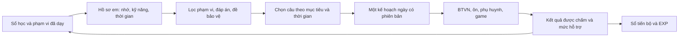

# Kiểm toán rút câu, ôn tập và EXP — đề xuất cho ba app

Ngày 23/09/2026. Mã nguồn đối chiếu: commit `36b83dd` tại `/Volumes/SSD NGOÀI/omr-app`.

**Kết luận:** hệ thống đã có nhiều thành phần tốt, nhưng các kênh chưa thống nhất cách hiểu “vừa sức”, “đã tiến bộ”, “đến lịch ôn” và “đạt ngày”. Ưu tiên là hợp nhất các quyết định này, sửa những trường hợp làm học sinh mất công hoặc mất thưởng, rồi mới tăng nội dung game và tinh chỉnh mô hình.

Đây là **bản kiểm toán và phương án đề xuất**, chưa phải thay đổi đã áp dụng cho học sinh. Lượt này chỉ bổ sung báo cáo, chương trình kiểm chứng và kết quả giả lập; không đổi thuật toán sản phẩm, dữ liệu học sinh hoặc triển khai máy chủ. Các cờ thực tế trên D1, mức độ phủ nhãn trong kho thật và hành vi trên máy học sinh chưa được kiểm tra trong lượt này.

## 1. Phạm vi đã đối chiếu

Đã truy vết các nhóm đường rút câu và nguồn thưởng dưới đây bằng tìm kiếm hàm, nơi gọi và đọc mã. Bản đồ graphify ngày 16/09 chỉ hỗ trợ tìm đường; kết luận dựa trên mã ngày 23/09. Phân biệt đường đang có nơi gọi với mã cũ, cũng như bài thầy chủ động giao với bài hệ thống tự đề xuất.

| Kênh | Hành vi hiện tại và điểm cần thống nhất |
|---|---|
| Hồ sơ kiến thức + kế hoạch ngày | Phát lại sổ học; FSRS theo từng câu; bậc dạng tăng/giảm theo kết quả. Ngân sách theo tốc độ và thời gian, nhưng còn sàn 8 câu. |
| Ôn đến hạn + ôn trước ca thi | Ưu tiên câu đến hạn, câu từng sai; thường giới hạn ôn ở 40% mục tiêu, có ngoại lệ. Phải tính cả ôn duy trì vào tiến bộ. |
| BTVN nâng đỡ | Lõi chung, phần riêng, thử thách; thiếu bằng chứng bắt đầu bậc Biết; thích nghi sau chặng. Lõi ghim có thể vượt mức cá nhân; đây phải là quyết định rõ của thầy. |
| Bài phụ huynh hằng ngày | Dùng phần ngân sách còn dư; ôn đến hạn → dạng yếu → bù kho; chặn câu mới đã gặp trong 3 ngày. Nhánh bù chưa giữ trần bậc từng dạng. |
| Thử thách riêng do bộ não đề xuất | Máy chủ lọc phạm vi cá nhân, câu đã làm 14 ngày, BTVN chưa nộp, trùng nội dung; chọn theo bậc hồ sơ rồi mức nhắm. |
| Đảo thần thú mới | Hai suất yếu, ôn, câu mới và thử thách; đúng nghỉ 30 ngày trừ câu đến hạn; sai 3 lần đổi câu. Dùng bậc riêng của game. |
| Đoàn Hộ Tống | Gọi bộ chọn mới ở chế độ nhẹ; câu riêng theo em; trùm chung theo kiến thức chung. Thời gian đã dựa phần/bậc/độ dài, chưa dựa tốc độ từng em. |
| Repair, tower, arena, Linh Tâm và cờ lùi | Vẫn có đường `chooseSessionWithRoles`, với luật gần đây/giãn cách khác bộ chọn mới. Cần chuyển từng đường, không chỉ sửa Đảo. |
| Luyện đề 2026 | Rút theo ma trận 18/4/6 và 50 phút; yêu cầu xác nhận đã học xong và kiểm khối. Không có hồ sơ xác nhận học xong toàn bộ trên máy chủ. Đây là chế độ thi thử, không nên coi là bài cá nhân mỗi ngày. |
| Giáo viên rút đề, gọi lên bảng, phiếu chữa | Rút theo bộ lọc/độ phủ hoặc dạng của lỗi; có cổng tránh qid. Một số đường ưu tiên độ khó gần câu sai, chưa lấy mức hiện tại của em làm chuẩn. |
| Luyện tự chọn theo dạng, khắc phục trên giao diện | Có đường trộn ngẫu nhiên và cắt danh sách; không mang đủ lịch sử, lịch ôn và ngân sách để tự cá nhân hóa. Cần nhận bộ câu từ máy chủ khi là bài học được ghi tiến độ. |
| Mã cũ | `rut-cau-thap.ts` còn được component game cũ gọi; StudentPortal hiện nhập game v2. `thu-thach-chon-cau.ts` phía client và `lich-on-lai.ts` không thấy nơi nhập trực tiếp trong lượt tìm kiếm. Không dùng chúng làm bằng chứng rằng màn hiện tại đang chạy luật ấy. |

Các điểm tốt nên giữ: lọc bằng chứng của chính học sinh; kiểm đủ nhãn kiến thức; bảo vệ đề chưa công bố và BTVN chưa nộp; khử bản sao bằng `content_group`; chọn ổn định theo seed; chỉ nạp nội dung câu được chọn; sổ EXP chống ghi trùng và cập nhật hồ sơ có kiểm tra phiên bản.

**Giới hạn của phạm vi “đã học”:** bằng chứng từng làm một câu chỉ cho biết em đã gặp những kiến thức được gắn nhãn ở câu đó. Nó chưa chứng minh thầy đã dạy đủ, em có mặt khi học, hoặc em đã hiểu. `content_group` hiện là dấu vân tay nội dung, chưa phải nhóm các bài dùng cùng phương pháp giải. Hai giới hạn dữ liệu này cần được xử lý trước khi gọi cá nhân hóa là chính xác.

## 2. Tám tình huống đã tái hiện

Chạy trực tiếp hàm sản phẩm với dữ liệu tổng hợp, không truy cập D1/R2. Các assertion đều qua. Đây là kiểm chứng ở mức hàm; không suy ra số học sinh thật bị ảnh hưởng.

| Mã | Đầu vào và kết quả hiện tại | Hệ quả | Sửa đề xuất |
|---|---|---|---|
| A01 | Đặt 10 phút, tốc độ đo được 240 giây/câu → mục tiêu 8 câu = 32 phút; mức tối thiểu 4 câu cũng cần 16 phút. | Em làm chậm bị giao vượt thời gian ngay từ kế hoạch. | Thời gian là giới hạn cứng cho bài tự động; bỏ sàn câu cố định, tính cả thời gian xem phản hồi. |
| A02 | Câu có 3 lần sai cũ, đã đúng lại và đến hạn → game chọn 0 câu; chỉ giữ 2 lần sai cũ → chọn được 1 câu. | Lỗi cũ tiếp tục chặn câu đã phục hồi trong tập lịch sử đang dùng. | Đếm chuỗi sai chưa chữa; sau can thiệp có đường trở lại. Không dùng tổng sai suốt lịch sử làm lệnh cấm. |
| A03 | 4 câu dễ khác nhau cùng ngày đều đúng → bậc hồ sơ = 2, nhưng quy tắc game với 4 bằng chứng đúng vẫn = 0. | Một em có thể bị kênh này coi là Biết, kênh kia coi là Vận dụng. | Một hàm đánh giá bậc dùng chung, có độ tin cậy, bằng chứng độc lập và kiểm tra chuyển giao. |
| A04 | Câu sai từ lâu, đúng hôm qua và hôm nay → cả hai ngày đều nằm trong `lenBac`, mỗi ngày đủ điều kiện khoản +6. | “Lên bậc” chưa chứng minh có chuyển bậc hay ôn đúng hạn. | Thưởng theo chuyển trạng thái/ôn đến hạn đã xác minh; khóa theo sự kiện tiến bộ, không chỉ qid × ngày. |
| A05 | Kênh phụ huynh: dạng yếu bậc 0, chỉ còn câu Hiểu → nhánh `bu_kho` vẫn chọn câu Hiểu. | Bù đủ số lượng có thể làm tăng độ khó ngoài chủ đích. | Nhánh bù cũng giữ trần cá nhân; thiếu thì trả ít hơn, hoặc chuyển dạng đã học phù hợp. |
| A06 | Ngày đạt thứ 21, cấp 10, ví 700, có 21 mảnh → đã có 1 khiên quà; rèn thêm được 1 khiên, ví còn 400. | Có thể có 2 khiên vào cùng mốc 21 ngày. Điều này không trái riêng điều kiện “khiên đầu không trước 21 ngày”, nhưng cần chốt nếu muốn mỗi khiên tương ứng 21 ngày. | Dùng một sổ cấp khiên chung; khiên đầu tiêu thụ 21 mảnh, những lần sau cũng cần thêm 21 mảnh. |
| A07 | Ngân sách 8 câu, 4 câu Mom bắt buộc, 3 câu ôn, lượt game 6 câu → danh sách có tổng 13 câu. | Bộ cắt việc tùy chọn chỉ kiểm còn chỗ trước khi thêm cả lượt. | Kiểm toàn bộ kích thước trước khi thêm; hỗ trợ lượt game ngắn hoặc để phần dư ngoài kế hoạch. |
| A08 | 8 câu đúng, đủ số lượng, không trễ; có câu ôn đến hạn nhưng chưa từng sai → `chua_len_bac`, chưa đạt ngày. | Ôn duy trì đúng vẫn có thể không được ghi nhận đủ để đạt. | Công nhận hoàn thành bài ôn duy trì hoặc bằng chứng tiến bộ trong kế hoạch; không bắt học sinh phải từng sai. |

Vị trí: [A01 — ngân sách](</Volumes/SSD NGOÀI/omr-app/server/src/ke-hoach-ngay.ts:230>), [A02 — bộ chọn mới](</Volumes/SSD NGOÀI/omr-app/src/game/than-thu-v2/core.ts:154>), [A03 — hồ sơ](</Volumes/SSD NGOÀI/omr-app/server/src/ho-so-nam-kt.ts:171>), [bậc game](</Volumes/SSD NGOÀI/omr-app/src/game/than-thu-v2/core.ts:64>), [A04 — chuyển trạng thái](</Volumes/SSD NGOÀI/omr-app/server/src/exp-chuyen-trang-thai.ts:44>), [A05 — bù kho](</Volumes/SSD NGOÀI/omr-app/server/src/parent-news-chon-cau.ts:185>), [A06 — quà và rèn](</Volumes/SSD NGOÀI/omr-app/server/src/exp-ho-so-game.ts:34>), [A07 — cắt việc tùy chọn](</Volumes/SSD NGOÀI/omr-app/server/src/ke-hoach-ngay.ts:446>), [A08 — đạt ngày](</Volumes/SSD NGOÀI/omr-app/src/lib/dat-nhiem-vu-ngay.ts:74>). Ôn duy trì thực sự được đưa vào kế hoạch ở [truy vấn câu đến hạn](</Volumes/SSD NGOÀI/omr-app/server/src/ke-hoach-ngay-d1.ts:184>).

Chạy lại: `node scripts/kiem-toan-ca-nhan-hoa-2309.mjs`. [Chương trình kiểm chứng](</Volumes/SSD NGOÀI/omr-app/scripts/kiem-toan-ca-nhan-hoa-2309.mjs>); [kết quả JSON](</Volumes/SSD NGOÀI/omr-app/docs/kiem-toan-ca-nhan-hoa-2309/bang-chung-va-mo-phong.json>).

## 3. Các vấn đề rộng hơn cần xử lý

1. **Có FSRS nhưng chưa có một chính sách ôn thống nhất.** Hồ sơ dùng FSRS-6 theo câu; game vẫn có nấc 1/2/3 và các khoảng 1/3/7 ngày; kênh mới có chặn 30 ngày, phụ huynh 3 ngày, thử thách 14 ngày. Các khoảng này có thể phục vụ mục đích khác nhau, nhưng hiện chưa được một nơi quyết định và giải thích xung đột.
2. **Nhãn yếu có thể quá lâu hoặc quá nhạy.** Bộ chọn game mới gom mọi bằng chứng sai/hỗ trợ trong lịch sử thành dạng yếu; hồ sơ lại có cơ chế thoát yếu. Không nên tiếp tục dành suất chữa lỗi cho dạng đã phục hồi chỉ vì một lỗi cũ.
3. **Độ khó mới là ba nhãn rộng.** Hai câu cùng “Hiểu” có thể khác hẳn số bước, lượng chữ, kiến thức phụ và tỷ lệ đúng. Chưa thể coi nhãn sao/bậc là xác suất làm được của từng em.
4. **Game thưởng nấc có thể cạn.** `advance` thưởng 10/20/30 khi đạt ba nấc; sau nấc 3, duy trì vẫn đúng thì riêng nguồn thưởng nấc bằng 0. Học sinh ôn chăm vẫn cần được ghi nhận, nhưng không thưởng lại việc thuộc đáp án.
5. **Cấp thú đang ảnh hưởng cơ cấu câu dài.** Tách cấp thú và năng lực học; học sinh mới chọn thú nhưng học tốt vẫn cần được làm Phần II/III phù hợp.
6. **Đúng/sai của Phần II đang gom cả câu.** EXP câu chỉ được tính khi đúng cả 4 ý; hồ sơ cần lưu ý nào sai để chữa đúng kiến thức. Giữ cách tính điểm thi riêng, tránh biến 3 ý đúng thành “không có tiến bộ”.
7. **Không đạt 7 ngày có thể mất khiên.** Đề xuất bỏ việc trừ tài sản đã kiếm do gián đoạn; dùng bài quay lại ngắn và kế hoạch phục hồi. Ngày nghỉ hợp lệ đã được loại khỏi bộ đếm hiện tại, nhưng em học chưa đạt vẫn có thể bị tính gián đoạn.
8. **Nhiều nguồn thưởng theo việc chưa có trần chung.** Câu đúng giảm EXP sau trần mềm, nhưng hoàn thành Mom/lô/bài/lên bảng/điểm ca có khóa riêng. Chia cùng công việc thành nhiều bài có thể làm mức thưởng khác đi. Đây là vấn đề thiết kế sổ thưởng, chưa phải kết luận đã có học sinh khai thác.
9. **Mã còn chứa luật cũ và chú thích cũ.** Có chú thích “kho lớp”, “36 mảnh”, bảng giá cũ không còn đúng với nhánh mới. Nên tách mô-đun chuyển đổi lịch sử khỏi luật đang dùng, cùng bảng quyết định cờ để tránh sửa nhầm.

## 4. Thiết kế cá nhân hóa dùng chung

### 4.1. Bốn lớp dữ liệu

| Lớp | Cần biết | Công dụng |
|---|---|---|
| Phạm vi học | Kiến thức thầy xác nhận đã dạy cho em; bằng chứng em đã học; kiến thức tiên quyết; nguồn và ngày xác nhận | Quyết định câu được phép đưa vào bài tự động. Không suy từ lớp hoặc chỉ tên chương. |
| Trí nhớ từng câu | Trạng thái FSRS, lần tự trả lời đầu tiên, lần xem lời giải, lịch đến hạn, phiên bản nội dung | Quyết định khi nào cần gợi nhớ lại câu/đơn vị nhớ. |
| Năng lực dạng và phương pháp | Kết quả trên nhiều nhóm bài độc lập, chuyển giao sang bài mới, mức hỗ trợ, độ tin cậy | Quyết định độ khó và việc cần dạy lại. Không đồng nhất với trí nhớ đáp án. |
| Tải và sở thích | Thời gian hôm nay, BTVN đến hạn, tốc độ theo loại câu, lần bỏ dở, lựa chọn học một mình/đồng đội | Quyết định số câu, cách trình bày và điểm dừng. |

Bổ sung `skill_id`, `prerequisite_ids`, `family_id` (cùng phương pháp/cấu trúc), `content_group` (bản sao nội dung), `question_version`. `family_id` không thay thế `content_group`: đổi số liệu nhưng giữ nguyên cách làm vẫn cùng family, còn thay câu chữ không đảm bảo là câu mới.

Câu thiếu nhãn hoặc có đáp án đang tranh chấp được đưa vào danh sách thầy duyệt; không dùng làm câu đo năng lực. Khi học sinh báo chấm sai, giữ bằng chứng, tạm loại tác động xấu tới hồ sơ nếu câu bị xác nhận lỗi; phát lại sự kiện đúng và bù quyền lợi có khóa chống lặp.

### 4.2. Một luồng quyết định

Trình tự bắt buộc: **lọc điều kiện → chọn mục đích học → xếp hạng → ghép dưới ngân sách → giữ chỗ → phát câu**. Bài phụ huynh và game sử dụng phần còn lại của kế hoạch, không tự tạo thêm một “ngày học” khác.

Thầy vẫn có thể giao nội dung mới hoặc bài kiểm tra có chủ đích. App phải đánh dấu đây là bài thầy giao, thể hiện tải vượt kế hoạch và đề xuất chia chặng/gia hạn; không âm thầm cắt bài, cũng không tính việc chưa học như bằng chứng em yếu.

### 4.3. Ước lượng mức vừa sức

Giai đoạn đầu dùng mô hình có thể giải thích: số lần tự làm đúng/sai trên các family khác nhau, mức câu, độ mới, số ngày cách lần trước; co ước lượng về mức chung khi mẫu ít. Có thể dùng Beta–Binomial cho thống kê thành công theo kỹ năng × bậc, rồi mô hình logistic/IRT có regularization khi đủ dữ liệu. **Tỷ lệ đúng quan sát chưa phải xác suất đã hiệu chỉnh.**

Khoảng mục tiêu khởi đầu để thử nghiệm:

| Tình trạng | Bài chính | Thử thách |
|---|---|---|
| Chưa đủ dữ liệu | 4–6 câu chẩn đoán ngắn trong phần đã dạy, có thể chia nhiều buổi | Không tự đẩy lên Vận dụng |
| Đang cần nâng đỡ | Ưu tiên câu ước tính có khả năng tự làm đúng 85–95%; bài mẫu rồi câu tương tự nếu cần | 0 hoặc 1 câu, bỏ khi vừa sai liên tiếp |
| Đang ổn định | Khoảng 80–90%; ôn xen kẽ và chuyển giao | Tối đa khoảng 1/6 lượt |
| Đã làm tốt nhiều nhóm | Tăng mức biến đổi/phân biệt phương pháp; không tăng số câu chỉ vì làm nhanh | Khoảng 65–80%, tự chọn và không quyết định đạt ngày |

Đây là **tham số thiết kế ban đầu**, không phải định luật áp dụng sẵn cho Hóa. Nghiên cứu “85%” xuất phát từ các điều kiện của bài phân loại và mô hình học; không chứng minh mọi học sinh Hóa cần đúng chính xác 85%. [Wilson và cộng sự, 2019](https://www.nature.com/articles/s41467-019-12552-4).

Tăng bậc khi có bằng chứng trên nhiều family và buổi khác nhau, kèm ít nhất một bài mới tự giải; giữ mức khi chưa chắc. Sai hai câu liên tiếp thì kiểm tra nguyên nhân và giảm một bước trong lượt, không lập tức kết luận toàn bộ dạng đã mất. Lỗi đọc đề/nhập số cần phản hồi khác lỗi thiếu kiến thức nền.

### 4.4. Xếp hạng minh bạch

Trong tập hợp đã qua điều kiện, có thể bắt đầu bằng điểm sau; mọi thành phần chuẩn hóa 0–1:

`điểm = 0,30 × cần sửa lỗi + 0,25 × cần ôn + 0,20 × giá trị chuyển giao + 0,15 × vừa sức + 0,10 × thiếu độ phủ − phạt trùng/mệt`.

Trọng số là giả thuyết cần đo. “Cần ôn” nên kết hợp nguy cơ quên, tầm quan trọng của kỹ năng và hạn thi, không chỉ số ngày quá hạn. Chọn dưới tổng thời gian dự kiến; trường hợp ngang điểm dùng seed theo em/ngày/phiên bản. Lưu lý do câu được chọn để thầy kiểm tra được.

Không trộn hai đại lượng: xác suất FSRS nhớ lại một đơn vị đã học và xác suất em giải đúng một bài mới. Cả hai có thể cần trong điểm chọn nhưng không được dùng thay nhau.

## 5. Lặp lại khoa học, giảm nhàm chán

### 5.1. Cách dùng FSRS

Giữ FSRS-6 đang ghim `ts-fsrs 5.4.2` làm chuẩn đối chứng; trước hết gỡ các luật chọn xung đột với lịch của nó. Mức nhớ mục tiêu 0,90 là điểm khởi đầu, cần đo tỷ lệ nhớ thực tế và số phút ôn theo em. Hiện thư viện được gọi theo hai kết quả Again/Good, một quan sát/ngày, sai ưu tiên; không tự suy Easy/Hard từ làm nhanh.

Benchmark của dự án hiện đã có FSRS-7 và các biến thể. Đề xuất thử FSRS-7 trên bản sao lịch sử, so dự báo với dữ liệu tương lai và chi phí ôn trước khi đổi thư viện. Benchmark dự đoán khả năng nhớ không chứng minh một thuật toán là tốt nhất cho bài giải Hóa hay chống chán. [Kho benchmark chính thức](https://github.com/open-spaced-repetition/srs-benchmark).

### 5.2. Quy tắc cụ thể

| Trạng thái | Việc app nên làm | Ghi nhận |
|---|---|---|
| Câu đúng, chưa đến hạn | Ưu tiên family khác hoặc biến thể chuyển giao cần thiết | Không thưởng ôn đến hạn giả |
| Đến hạn và tự nhớ được | Đưa vào lượt; sau trả lời cập nhật lịch | Ghi nhận ôn duy trì, dù câu chưa từng sai |
| Vừa sai lần đầu | Phản hồi đúng nguyên nhân; cho xem một bước gợi ý hoặc bài mẫu | Giữ kết quả đầu để đo; không trừ EXP đã kiếm |
| Thử lại trong cùng buổi | Có thể thử sau 2–4 câu xen giữa hoặc khoảng 5–10 phút, tùy buổi | Là luyện lại ngắn hạn, không coi là bằng chứng nhớ dài hạn; lịch cụ thể này cần thử nghiệm |
| Sai lặp lại chưa chữa | Tạm dừng cùng câu; quay về một kiến thức nền, gợi ý cụ thể, báo thầy khi cần | Một nhiệm vụ dạy lại có đường hoàn thành và trở lại luyện |
| Đã chữa và tự làm được | Trả lại điều kiện tham gia; ưu tiên biến thể rồi kiểm tra lại có giãn cách | Xóa trạng thái “đang mắc lỗi”; vẫn giữ lịch sử |
| Thiếu câu phù hợp | Lượt ngắn hơn, chuyển dạng đã học, hoặc kết thúc đủ ngày | Không lấp bằng câu quá khó/chưa học |

Mỗi câu/bản sao có tối đa một quan sát độc lập được thưởng đầy đủ trong ngày. Không xếp hai bản sao cạnh nhau. Một lượt 6 câu thường chỉ một câu mỗi family; tối đa hai khi đang chữa lỗi có chủ đích. Các biến thể không được tự động coi là đã ôn chính xác câu gốc trong FSRS; chúng cập nhật bằng chứng chuyển giao ở cấp family/kỹ năng.

Lặp kiến thức bằng nhiều yêu cầu: nhận diện điều kiện → chọn phương pháp → tính kết quả → phân tích lời giải sai → giải biến thể. Không chỉ đổi vài con số rồi gọi là mới. Chỉ phát biến thể đã được kiểm tra đáp án và nhãn.

Cho học sinh tự nhớ trước khi mở lời giải. Thực nghiệm retrieval practice hỗ trợ học khái niệm từ tài liệu khoa học; điều này củng cố hướng thiết kế, không bảo đảm mọi dạng tính toán sẽ có cùng mức hiệu quả. [Karpicke & Blunt, 2011](https://learninglab.psych.purdue.edu/downloads/2011/2011_Karpicke_Blunt_Science.pdf).

Xen kẽ 2–3 kỹ năng liên quan khi đã có nền tảng, để em phải nhận ra nên dùng cách nào. Với em mới học, bắt đầu bằng một nhóm ví dụ ngắn trước. Thử nghiệm ngẫu nhiên ở các lớp Toán 7 ủng hộ luyện xen kẽ; cần kiểm chứng khi áp dụng cho học sinh Hóa của lớp. [Rohrer và cộng sự, 2019](https://gwern.net/doc/psychology/spaced-repetition/2019-rohrer.pdf).

## 6. Một ngày học đủ ngắn, có tiến bộ nhìn thấy

Thời gian mặc định có thể giữ 20 phút; cho phép buổi ngắn 5–8 phút khi quay lại, và lựa chọn thời gian thực tế. Không coi đây là lý do cố tình giảm chuẩn vô hạn: kế hoạch ngắn phải có mục tiêu kiến thức cụ thể và được chốt trước lúc làm.

Trong ngân sách, dành chỗ cho thời gian đọc phản hồi/sửa sai, không lấy toàn bộ phút chia cho thời gian trả lời câu. Ước lượng thời gian theo phần, dạng, độ dài và hồ sơ em; ít mẫu thì dùng mặc định bảo thủ. Bỏ thời gian mở tab nền/gián đoạn khỏi phép đo; làm chậm không đồng nghĩa với kém hiểu.

Ví dụ một lượt có thể gồm một câu khởi động, hai câu đến hạn, hai câu sửa lỗi/chuyển giao, một câu thử sức. Đây là mẫu minh họa, không chia cứng cho mọi em. Hôm không có câu đến hạn thì dành chỗ cho kỹ năng đã học còn thiếu bằng chứng; hôm có bài thầy giao thì dùng chính bài đó để hoàn thành kế hoạch.

| Hồ sơ hôm nay | Ví dụ điều chỉnh |
|---|---|
| Em đang vướng kiến thức nền | 4–6 câu ngắn, có bước hướng dẫn và ít nhất một kiểm tra tự làm; chưa ép câu thử thách. |
| Em làm ổn nhưng hay quên | Ưu tiên ôn đúng hạn, một biến thể để phân biệt nhớ đáp án với hiểu. |
| Em làm tốt | Ít câu lặp nguyên văn, tăng chuyển giao và lựa chọn thử thách; cùng giới hạn thời gian. |
| Em trở lại sau nghỉ | 2–4 câu ngắn; chọn phần đang còn nhớ và một chỗ cần phục hồi; chia backlog qua các ngày. |

**Đạt ngày đề xuất:** hoàn thành phần cốt lõi đã chốt theo thời gian cá nhân, có bằng chứng học hợp lệ và đạt tiêu chí của mục tiêu hôm đó. Ví dụ hoàn thành ôn duy trì, tự giải biến thể sau hướng dẫn, hoặc hoàn thành chặng BTVN phù hợp. Không đòi “từng sai” mới đạt; không bắt hoàn tất toàn bộ backlog ngoài kế hoạch; không cho bấm đoán liên tục là đạt. Ngày toàn sai vẫn ghi công học và gửi hướng hỗ trợ, chưa tự suy có tiến bộ độc lập.

## 7. Đoàn Hộ Tống và động lực quay lại

Trong mã hiện tại, hiệp có câu đi qua công thức 90 giây cho Phần I, 120 cho Phần III, cộng bậc và thời gian đọc, kẹp tối đa 180; hiệp trùm 180. Các hằng dự phòng cũ 40/60 vẫn tồn tại khi không truyền câu. Không nên tuyên bố đã cá nhân hóa thời gian chỉ vì tăng khỏi 30 giây. [Hàm thời gian](</Volumes/SSD NGOÀI/omr-app/src/game/than-thu-v2/doan-core.ts:149>).

Đề xuất:

- Luyện cá nhân không ép đếm ngược; đo thời gian ngầm để điều chỉnh tải. Với Đoàn, cho nhóm chế độ thường có hạn mềm và chế độ thử thách hẹn giờ tự chọn.
- Thời lượng dựa trên ước lượng bảo thủ theo từng câu và em; nhịp nhóm phải đủ cho em cần nhiều thời gian nhất. Hết hạn mềm cho phép tiếp tục hoàn thành cá nhân, không tự ghi thiếu kiến thức vì chậm.
- Em yếu có câu đúng mức và một vai đóng góp thật. Mỗi em tự trả lời trước; trợ giúp được ghi nhận riêng, không coi đáp án được trợ giúp là bằng chứng độc lập.
- Mỗi ngày đổi nhiệm vụ/cách phối hợp và tình huống Hóa, nhưng giữ mục tiêu học. Có điểm kết thúc rõ sau một chặng; tiếp tục là lựa chọn.
- Theo dõi tiến bộ so với chính em: kỹ năng đã tự giải thêm, lần ôn vẫn nhớ, lỗi đã phục hồi. Báo cáo thầy ưu tiên em cần giúp; phụ huynh nhìn kế hoạch còn lại và thành quả, không tiếp tục giao chồng bài.
- Mục tiêu tuần 5/7 ngày có chỗ nghỉ; tổng ngày đạt để mở khiên vẫn tích lũy, không xóa vì đứt chuỗi. Quà nhỏ có lịch và được chọn; không dùng may rủi hoặc cảnh báo mất tài sản làm động lực chính.
- Nhắc một lần trong khung giờ đã chọn khi có việc phù hợp; hoàn thành rồi thì dừng. Đo quay lại có học thật, không tối đa số lần mở app.

Cơ sở định hướng là quyền lựa chọn, cảm nhận mình làm được và kết nối với người khác. Tổng quan của Ryan & Deci hỗ trợ ba yếu tố này; cách phối hợp cụ thể với game của lớp là đề xuất cần thử nghiệm. [Ryan & Deci, 2020](https://selfdeterminationtheory.org/wp-content/uploads/2020/06/2020_RyanDeci_IntrinsicandExtrinsic.pdf).

## 8. Kiểm toán EXP hiện tại

Các mức sau lấy từ mã, chưa xác minh cờ bật thực tế của từng em. Luật cũ `syncAcademic` có trần 100/ngày và dừng trả cho sự kiện sau mốc chuyển của em; luật mới dùng sổ `exp_so`. Không cộng hai bảng như hai nguồn độc lập sau mốc.

| Nguồn hiện tại | Mức trong mã |
|---|---|
| Câu đúng Phần I | 2 / 3 / 5 EXP theo sao 0 / 1 / 2 |
| Câu đúng Phần II | 3 / 5 / 8; hiện cần đúng đủ 4 ý |
| Câu đúng Phần III | 4 / 6 / 10 |
| Câu sau trần mềm | Qua 2 × mục tiêu câu/ngày: nhận 25%, làm tròn lên, ít nhất 1 |
| Câu đúng đầu ngày | 10 |
| Đạt ngày từ 22/09 | 80 |
| Chuỗi đạt | 2 × min(số ngày, 10), tối đa 20 |
| Xong lô BTVN | 20 đúng nhịp / 8 trễ nhịp |
| Nộp cả BTVN đúng hạn | 30 |
| Xong bài Mom | 10 mỗi bài |
| Ôn “lên bậc” | 6 mỗi qid/ngày theo định nghĩa hiện tại |
| Chuyển sang khắc phục | 30 theo mốc/lần sai |
| Lên bảng | 15 đạt / 5 chưa đạt |
| Điểm ca thi | 3 × điểm làm tròn, tối đa 30 |
| Trở lại | 30 sau ít nhất 3 ngày không có sự kiện; tối đa một lần/14 ngày |
| Game đạt nấc | 10 / 20 / 30; cùng trần game 120/ngày |
| Đoàn: tiếp sức | 5/lần, tối đa 5 lần/ngày, trong trần game |
| Đoàn: kết chặng | Thắng lần đầu ngày 5/10/15; lần sau 3/5/8; vỡ giáp +3/trùm, trong trần game |
| Mảnh khiên | 1/ngày đạt; 21 mảnh/khiên; rèn cần 300 EXP và còn dự trữ 400 |
| Hấp thụ để lên cấp | Đạt: tối đa 200/ngày; có ít nhất 4 câu khác nhau nhưng chưa đạt: 120; còn lại 0 |

Nguồn: [bảng giá](</Volumes/SSD NGOÀI/omr-app/server/src/exp-cau-hinh.ts:9>), [tính khoản](</Volumes/SSD NGOÀI/omr-app/server/src/exp-hoc-tap.ts:114>), [game đạt nấc](</Volumes/SSD NGOÀI/omr-app/src/game/than-thu-v2/core.ts:124>), [thưởng Đoàn](</Volumes/SSD NGOÀI/omr-app/src/game/than-thu-v2/doan-core.ts:365>), [hấp thụ](</Volumes/SSD NGOÀI/omr-app/src/lib/hap-thu-ngay.ts:15>).

**200 là trần hấp thụ, không phải EXP chắc chắn kiếm được.** Một em đạt ngày không đương nhiên có đủ 200 trong ví. Đặc biệt, không thể dùng giả định luôn có thưởng nấc mới để bảo đảm thu nhập dài hạn. Chênh lệch số bài được giao cũng có thể làm chênh EXP dù thời gian và tiến bộ tương đương.

## 9. Phương án EXP đề nghị

### 9.1. Thưởng việc học cốt lõi trước

Đề nghị **tổng 220 EXP cho một ngày hoàn thành kế hoạch cá nhân hợp lệ**. Đây là tổng thu nhập của phần cốt lõi, không cộng thêm 220 lên bảng thưởng cũ.

Ví dụ em đã nhận 136 EXP từ các sự kiện thuộc kế hoạch thì khi hoàn thành nhận bù 84. Nếu chưa hoàn thành, giữ những khoản hợp lệ đã kiếm; không thu hồi vì sai câu tiếp theo. Phần thưởng cốt lõi có trần 220; các sự kiện vượt trần không tự biến thành khoản mới bằng cách chia bài/đổi màn.

Chỉ bù khi có bằng chứng học đáp ứng mục tiêu đã chốt, không bù do đăng nhập, hết giờ hoặc xem lời giải. Gợi ý được cho phép trong giai đoạn học; phải có bước tự làm phù hợp trước khi xác nhận mục tiêu độc lập. Với em rất yếu, bài phải quay về nền đủ sức và báo thầy khi liên tục không đạt; không giữ em trong vòng lặp bài khó.

**Phần tự chọn thêm:** tối đa 120 EXP/ngày trên toàn bộ kênh. Chỉ thưởng ôn đến hạn, chuyển giao mới, phục hồi thật hoặc đóng góp đồng đội đã xác minh; không tính lại sự kiện đã được trả trong phần cốt lõi. Mức khởi đầu có thể là 6 EXP cho một ôn duy trì độc lập đến hạn, 10 cho chuyển giao sang family mới phù hợp, 5 cho trợ giúp hữu ích tối đa 5 lần. Các mức này nằm trong quỹ 120, cần đo trước khi chốt.

Mọi nguồn hiện có — kể cả lên bảng và thi — phải ánh xạ vào cùng sổ/quỹ. Các thành tích lớn có thể thêm huy hiệu thay vì tiếp tục phát EXP không giới hạn. Làm đúng bài quá dễ/chưa đến lịch có phản hồi nhưng không thưởng tiến bộ; làm sai rồi chữa trong một ngày không sinh nhiều lần thưởng.

Tối đa tăng trưởng vẫn **200/ngày**; làm nhiều không vượt giới hạn. Phần thực học nhưng chưa đạt có thể giữ trần 120, nhưng thay điều kiện “4 qid” bằng tiêu chí học hợp lệ của kế hoạch, vì sàn 4 không phù hợp mọi buổi ngắn/câu dài. Mảnh chỉ đến từ ngày đạt.

### 9.2. Ví, cửa hàng, khiên

Giữ EXP đã kiếm và đã hấp thụ tách biệt. Mua/rèn chỉ dùng ví; giữ dự trữ 400 như hiện tại. Hiển thị rõ số có thể tiêu = max(0, ví − 400), chi phí món và số dư sau mua. Tỷ lệ hiện có 1 EXP dư = 1 vàng có thể giữ. Không tự tiêu vào đồ/rèn; có thể đề xuất lựa chọn nhưng học sinh quyết định.

Với thu nhập 220 và hấp thụ 200, mỗi ngày còn 20. Vì vậy ngày 21 mới có 420 trong ví, chỉ 20 có thể đổi; giá món thường 20/40 hiện tại phù hợp mốc này. Để tuần đầu vẫn có thành quả hình ảnh, đề nghị một phụ kiện khởi đầu miễn phí sau mục tiêu tuần, chọn từ danh mục riêng; không cần lấy tiền nuôi thú để mua quà đầu tiên.

Khiên đầu: cấp ≥10 và đủ 21 ngày đạt, cấp 1 khiên miễn phí EXP **nhưng tiêu thụ 21 mảnh**. Khiên sau: thêm 21 mảnh +300 EXP, vẫn giữ 400 dự trữ. Mọi khiên mới, kể cả quà tiến hóa, phải đi qua cùng quyền nhận; tiến hóa có thể tặng ngoại hình thay thế. Đề nghị tối đa 5 khiên chưa dùng tổng cộng, mảnh vẫn được giữ.

Đây là thay đổi so với cơ chế hai nguồn quà/rèn hiện tại. Bảo toàn khiên, cấp, đồ và số dư đã có; không áp dụng phép trừ hồi tố. Chuyển đổi cần lưu quyền đã nhận và mảnh tương ứng, có sổ đối chiếu.

### 9.3. Mô phỏng kiểm tra các mốc

Giả định tài khoản mới từ cấp 1, ví 0, mỗi ngày trong mô hình đều hoàn thành kế hoạch, hấp thụ đủ 200; chưa mua đồ và không có quà lịch sử. Khi đủ điều kiện rèn lần sau, mô phỏng giả định em chọn rèn. Đây là phép tính kinh tế, không dự báo kết quả học hay tỷ lệ quay lại.

| Kịch bản | Cấp 10 sớm nhất | Khiên đầu | Ví ở ngày đạt 21 | Ví sau khiên thứ 2 ở ngày đạt 42 |
|---|---:|---:|---:|---:|
| Chỉ hoàn thành cốt lõi: 220/ngày | Ngày học thứ 12 | Ngày đạt thứ 21 | 420 | 540 |
| Cốt lõi +40 EXP học thêm hợp lệ: 260/ngày | Ngày học thứ 12 | Ngày đạt thứ 21 | 1.260 | 2.220 |
| Cốt lõi 5 ngày/tuần, bắt đầu thứ Hai | Ngày lịch 16 | Ngày lịch 29 | 420 | 540 vào ngày lịch 58 |

Khiên thứ hai sớm nhất sau tổng 42 ngày đạt trong mô hình mới. Mua đồ có thể làm lần rèn sau muộn hơn do thiếu EXP, không làm mất mảnh. Khoản tích lũy của em học thêm đem lại lựa chọn ngoại hình sớm hơn, không tăng tốc cấp và khiên.

### 9.4. Toàn bộ đường cấp

Hiện cấp 1→10 cần 2.400 EXP, đúng 12 × 200; nên giữ. Nhưng thanh 9→10 cần 430, rồi 10→11 tăng lên 1.000; toàn bộ tới cấp 120 cần 238.200, sớm nhất 1.191 ngày hấp thụ tối đa. Tiến trình dài này cần được cân nhắc với độ dài khóa học. [Bảng cấp hiện tại](</Volumes/SSD NGOÀI/omr-app/src/game/than-thu-hoa-hoc/kinh-nghiem.ts:68>).

**Phương án để thầy cân nhắc cho phần sau cấp 10:** giữ 9 thanh đầu, từ cấp `c=10..119` dùng `10 × round((450 + 3,5 × (c−10))/10)`. Tổng tới cấp 120 là **72.900 EXP, sớm nhất 365 ngày học đủ 200**; thanh tăng đều từ 450 đến 830. Chương trình mô phỏng đã kiểm tổng và tính không giảm. Đây là mục tiêu tiến trình sản phẩm, không có nghiên cứu nào quy định đường cấp này là tối ưu.

Nếu giữ đường 1.191 ngày, nên có hành trình 4–6 tuần với mục tiêu kỹ năng và phần thưởng hoàn thành riêng, để học sinh vẫn thấy tiến bộ khi cấp lớn tăng chậm. Cả hai phương án đều cần quy tắc chuyển đổi bảo toàn quyền lợi; không reset cấp hay lấy mất EXP.

## 10. Tối ưu máy chủ cùng với chất lượng học

| Việc | Cách làm đề nghị | Cách kiểm |
|---|---|---|
| Một kế hoạch cho ba app | Lưu theo em/ngày/policy version; mỗi câu có mục đích, family, thời gian dự kiến, lý do chọn. Điều chỉnh phần chưa mở; giữ phiên đang làm. | Mở hai thiết bị vẫn cùng kế hoạch, không phát thưởng hai lần. |
| Tránh giao chồng giữa các kênh | Giữ chỗ câu/content group/family bằng giao dịch; mỗi giữ chỗ có nguồn, hạn và trạng thái. Kiểm lại phạm vi khi phát và khi nộp. | Hai yêu cầu đồng thời từ phụ huynh và game không phát cùng bản sao ngoài chủ đích. |
| Cập nhật hồ sơ tăng dần | Lưu snapshot FSRS đầy đủ, phiên bản mô hình và con trỏ sự kiện; cập nhật bằng phần mới. Sự kiện đến muộn/chấm sửa thì phát lại từ checkpoint phù hợp. | Kết quả incremental khớp full replay; không chỉ tăng bộ đếm khi sửa điểm. |
| Giảm đọc lịch sử | Hiện `attempts` đọc tới 3.000 bản ghi JSON, hồ sơ có đường phát lại toàn sổ. Dùng bảng tổng hợp gần đây + truy vấn theo em/skill/day; giữ sổ gốc để kiểm toán. | Đo số rows đọc, thời gian CPU và dung lượng trả ở hồ sơ dài. |
| Tối ưu chọn câu | Metadata và đặc trưng câu tính sẵn; tạo map theo skill/level/family một lần; chỉ nạp nội dung các câu được chọn. | So sánh lựa chọn và lý do trước/sau tối ưu, không đánh đổi phạm vi để nhanh. |
| Bộ nhớ đệm | Kho chung khóa theo phiên bản; hồ sơ cá nhân theo em + revision; trạng thái đề bảo vệ có vô hiệu hóa rõ. | Cập nhật đề, thu hồi câu, đổi phạm vi phải có hiệu lực đúng. |
| Sổ thưởng | Một khóa sự kiện, một quỹ ngày, ghi số dư và biên nhận nguyên tử; có outbox hoặc tác vụ phục hồi phần hậu xử lý. | Retry, mất mạng, gửi trễ qua 0h VN, hai máy cùng nộp đều đúng số dư. |
| Tầng AI | Lập gợi ý trước hoặc chạy nền; mô hình không tự bỏ bộ lọc, sửa đáp án, cấp EXP hay chọn ngoài ngân sách. | Tắt AI thì bộ chọn tất định vẫn phục vụ đủ; không gọi mô hình lớn cho mỗi câu. |

Mục tiêu hiệu năng cần đo, chưa phải kết quả đã đạt: lập lượt từ bộ đệm p95 dưới 300 ms; lượt cần đọc kho dưới 1 giây tại vùng triển khai; phản hồi chấm dưới 500 ms, không tính mạng phía học sinh. Đo p99, chi phí D1/R2 và lỗi đồng thời trước khi nhận định nhanh hơn. Không thể suy “server nhanh nhất” từ vài hàm chạy cục bộ.

## 11. Triển khai theo thứ tự và tiêu chí nghiệm thu

| Đợt | Công việc | Điều kiện xong |
|---|---|---|
| P0 — sửa bất nhất đã chứng minh | A01–A05, A07–A08; thống nhất đánh giá bậc; kiểm chấm/nhãn; quyết định chính sách A06 trước khi đổi khiên. | Các tình huống có kết quả mới đúng; các đường đang gọi đều dùng luật; không mất dữ liệu/quyền lợi. |
| P1 — một kế hoạch, một sổ thưởng | Planner chung, thời gian thật, family, giữ chỗ liên kênh; ôn duy trì được ghi nhận; thu nhập cốt lõi và quỹ tự chọn. | Không câu tự động ngoài phạm vi; không cộng trùng; mốc cấp10 ≥12 ngày và khiên ≥21; ngân sách không vượt vì ghép lượt. |
| P2 — trải nghiệm và đo hiệu quả | Can thiệp sau sai liên tiếp, biến thể được duyệt, thời gian Đoàn theo em; mùa kỹ năng; thử FSRS-7 ở chế độ đối chiếu. | Kết quả nhớ/chuyển giao và trải nghiệm tốt hơn trên dữ liệu riêng; nhóm yếu không bị tăng tải hoặc giảm cơ hội nhận thưởng. |

Trước phát hành: kiểm lại toàn bộ kênh ghi sổ, cờ chuyển luật, các lần chấm sửa, các hồ sơ cũ và hai thiết bị. Test giả lập trong báo cáo chỉ chứng minh 8 tình huống; không thay thế bộ kiểm thử sản phẩm hay nghiệm thu production.

Đo trong hai tuần đầu ở chế độ chạy đối chiếu không phát câu/EXP mới: số câu ngoài phạm vi, trùng nội dung, vượt thời gian, độ lệch dự báo, số lần thiếu nguồn và phân bố thu nhập theo nhóm. Sau đó thử có kiểm soát khoảng 6 tuần; chia nhóm phù hợp theo lớp để giảm ảnh hưởng lẫn nhau của game, phân tầng mức ban đầu. Cỡ mẫu cần tính theo quy mô và biến thiên thực, không mặc định vài chục em là đủ kết luận.

Chỉ số chính: tỷ lệ tự giải **biến thể chưa gặp** sau 7/21 ngày; kiến thức giữ được trên mỗi phút; số lỗi đã phục hồi có bằng chứng; tỷ lệ hoàn thành ở nhóm cần nâng đỡ. Chỉ số trải nghiệm: quay lại có học trong ngày 7/28, bỏ dở sau sai hai lần, phản hồi chán/lặp, tổng thời gian thực. Không tối ưu tỷ lệ mở app bằng cách tăng thông báo hoặc tăng lượng bài.

Các mốc đo 7/21 ngày là cửa sổ đánh giá so sánh, không bắt toàn bộ câu dùng một lịch ôn 7/21 cứng. Công khai định nghĩa trước khi thử; đối chiếu bằng điểm chấm đã được thầy xác nhận trên mẫu đại diện.

**Phương án ưu tiên:** sửa những bất nhất khiến học sinh làm đúng vẫn bị thiệt, gom tất cả kênh về một kế hoạch theo thời gian và bằng chứng cá nhân, rồi đưa quỹ EXP 220/200 cùng lịch ôn thống nhất vào thử nghiệm. Mục tiêu là mỗi em có một việc vừa sức và một tiến bộ kiểm chứng được mỗi ngày; độ hấp dẫn đến từ tiến bộ, lựa chọn và đồng đội.
