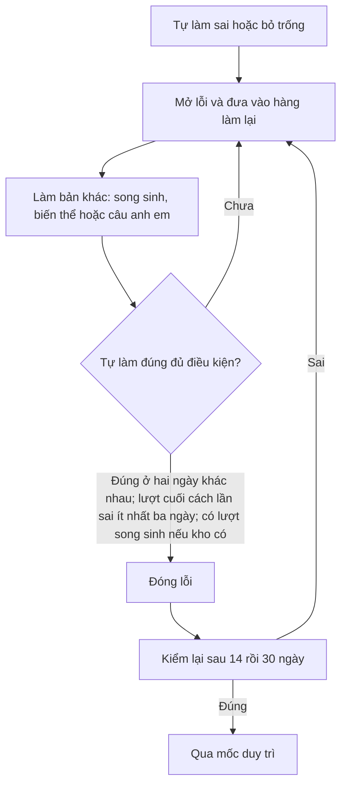

# Sáu câu song sinh cho mỗi câu trong kho

Phạm vi: Phần I, II, III, gồm lý thuyết và tính toán; dùng cùng bộ phân loại tự luận của ứng dụng để loại toàn bộ câu tự luận khỏi sinh học liệu. Không xóa câu gốc hay đổi vị trí song sinh lịch sử.

Phần I/III đặt mục tiêu sáu bản khác. Phần II đặt mục tiêu 24 ý mới khác nhau, tương ứng sáu nhóm bốn ý cùng đề dẫn. Đảo lựa chọn không được coi là một bản khác mới.

## Vòng xử lý câu sai hiện tại

Luật mặc định của `loi-hoc-luat.ts` tính lượt tự làm từ 29/09/2026. Lượt có hỗ trợ hoặc làm trong 12 giờ sau khi đọc lời giải không được dùng để đóng lỗi.



Nếu chưa có học liệu khác, hệ thống còn đường dùng câu gốc với lựa chọn đảo; đường này không được tính là kho đã có sáu câu song sinh chuẩn. Các mốc trên có thể được cấu hình bởi cơ chế tự hiệu chỉnh.

Mỗi bản mới phải qua kiểm định dạng, kiểm lời giải, giải mù trong thư mục riêng không thấy đáp án đề xuất, khớp đáp án, xác nhận chắc chắn và có lý do giải độc lập. Thiếu bất kỳ bằng chứng nào thì không nhận. Hai lượt AI khớp nhau vẫn có thể cùng sai; đây không phải chứng nhận đúng chuyên môn tuyệt đối 100%.

## Vận hành

Sau khi Worker chứa `/kho/may-soan/nap-toan-kho` đã được phát hành, trên máy có Claude CLI đã đăng nhập theo gói Claude của thầy, cùng `OMR_MA_BI_MAT` hợp lệ:

```sh
node scripts/loi-giai/may-soan.mjs --nap-song-sinh-toan-kho --lop tat-ca --mot-lan
```

Chỉ nạp hàng học liệu, không dùng `--nap-hang` để lập lại chỉ mục kho. Việc đang xử lý, lượt thử và trạng thái trượt được giữ nguyên. Câu chưa ánh xạ, JSON lỗi và câu đang nghi đáp án phải được giải quyết trước khi chứng nhận hoàn thành. Bản lịch sử không được tự đánh dấu đã kiểm; nếu đủ sáu bản cấu trúc nhưng thiếu bằng chứng, cần kiểm lại các bản đó.

Khóa bí mật chỉ đặt trong môi trường hoặc GitHub Actions Secrets, không ghi vào mã, báo cáo hay chat. Đăng nhập GitHub trên trình duyệt không thay thế khóa AI hoặc mã máy chủ. Theo yêu cầu mới, không dùng khóa AI API: chỉ dùng Claude CLI đã đăng nhập theo gói. Đọc `docs/dac-ta-claude-song-sinh-sau-ban-0710.md` để giao Claude soạn và xuất gói cho Codex kiểm lại; runner hiện có tự nộp, không dùng thẳng cho chế độ chỉ soạn.

## Quét sau khi nạp

Workflow `Kiểm độ phủ sáu câu song sinh (chỉ đọc)` quét D1 bằng SELECT. Báo cáo chứa qid và số lượng, không chứa đề hay đáp án. Cổng chỉ xanh khi mọi câu đủ sáu bản khác nhau có bằng chứng và không còn câu thiếu ánh xạ. Cổng đỏ có báo cáo đính kèm để tiếp tục xử lý; không được dùng số lượng bản thuần túy để tuyên bố hoàn thành.

Có thể chạy chương trình kiểm bằng esbuild rồi Node, đặt `CLOUDFLARE_API_TOKEN` và `CLOUDFLARE_ACCOUNT_ID` trong môi trường. Mã thoát 2 nghĩa là còn thiếu mục tiêu; 1 nghĩa là lỗi quét. Báo cáo này kiểm cấu trúc và bằng chứng đã lưu, không xác minh danh tính người kiểm hay chứng minh độc lập từng định luật khoa học.
