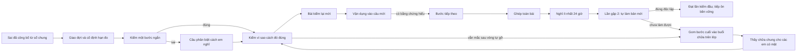

# Vòng chữa câu sai: vận hành toàn trường và nghiệm thu chất lượng

Phạm vi đã được thầy chọn: **tất cả học sinh**. Đích học tập: em hiểu chỗ sai, giải thích được quan hệ đúng, vận dụng vào bài mới và tự làm được bản tương đương ở lần gặp lại thứ hai. 90% là mục tiêu cần đo bằng học sinh thật; kiểm thử phần mềm không chứng minh tỷ lệ này.

## Luồng đã triển khai trong PR



Mỗi màn chỉ hỏi một việc. Phản hồi ở lại để em đọc, chỉ chuyển khi em bấm tiếp. Sau câu phân biệt, em có thể mở phần “Hiểu bước này trong bài”: mục tiêu, ý nghĩa đại lượng, lý do, điều kiện áp dụng và mối nối sang bước sau. Một đáp án sai chỉ tạo giả thuyết; chỉ câu xác nhận phù hợp mới được dùng để gọi tên nguyên nhân. Đúng chẩn đoán chưa được xem là hiểu bước.

Bằng chứng hiểu bước cần câu kiểm lý do và câu chuyển giao mới không có gợi ý ở câu đó. Gợi ý tăng lần lượt ba mức, retry giữ nguyên mức và thời điểm; câu đã lộ không được dùng lại để tạo bằng chứng. Khi làm sai ở vòng kiểm bước, hệ thống tự đối chiếu điều kiện áp dụng, mở ví dụ đã duyệt và cho em thử lại bằng câu mới. Nếu vẫn mắc sau số vòng hỗ trợ cho phép hoặc chưa nối được bài tổng hợp, hệ thống tự xếp vào buổi chữa trên lớp. Không có nút gửi riêng cho thầy ở giữa vòng tự chữa.

## Thầy chỉ chữa bước cuối ở mục chiếu lên bảng

**Lên bảng → Câu cần chữa → Chiếu lên bảng câu cần chữa.** Tổng quan chỉ có số liệu và nút dẫn tới đúng thẻ này; đã bỏ ô trả lời riêng từng học sinh. Route hàng thầy cũ chỉ đọc, không nhận gửi lời gỡ/mở lại cá nhân.

1. Dùng bước Điểm danh có sẵn của Lên bảng. Hàng chữa gom theo lớp, nhóm nội dung đã xác minh, phiên bản, bước và nguyên nhân đã xác nhận; ưu tiên nhóm ảnh hưởng nhiều em rồi đến nhóm chờ lâu. Cùng câu nhưng khác chỗ mắc được chữa riêng. Không gán nguyên nhân khi chưa đủ bằng chứng.
2. Màn riêng của thầy có câu vừa làm, đáp án em gửi, số vòng hỗ trợ và các bước đã hiểu. Tờ chiếu chỉ có đề gốc, bảng/ảnh/lựa chọn và quan hệ cần nối. Không chiếu tên em, đáp án sai cá nhân hoặc bảng xếp hạng; lời gỡ chỉ mở khi thầy bấm. Mỗi nhóm một tờ, có khoảng trống viết bảng.
3. Với câu tổng hợp, thầy chọn bước cần gỡ từ bằng chứng trước khi mở tờ. Với lỗi bước đã xác định, app chọn đúng bước. Thầy bấm **Thầy chữa** ngay trên tờ. Chỉ những em có mặt trong buổi được mở lại bước; các em vắng giữ hàng chữa. App tự chia lô tối đa sáu em để nằm trong ngân sách D1; mất mạng giữa lô thì thử lại bằng đúng receipt đã lưu.
4. Xác nhận buổi chữa không biến thành “đã hiểu” hoặc “đã tự sửa”. Chỉ bước vừa chữa được đặt lại để em tự kiểm lý do, làm một bước mới, chuyển giao, ghép bài và kiểm chứng sau ít nhất 24 giờ; bước đã hiểu ở đúng bản được giữ. Học sinh mở lại câu đang chữa để tiếp tục. Kết quả gặp thứ ba không sửa lại KPI gặp thứ hai đã thất bại.
5. Hết câu mới thì lưu lý do trong hàng chuẩn bị học liệu, không hỏi lại câu đã lộ và không bắt thầy nhắn riêng cho em. Khi nội dung bổ sung được duyệt đúng phiên bản, em mở lại là hệ thống tự tiếp, giữ bằng chứng/đáp án/ngày giao cũ. Chuẩn bị và duyệt học liệu là công việc chuyên môn dùng chung trước buổi, không phải chữa tay từng em.

API giáo viên: `POST /gv/chua-cau-sai/hang-chieu` và `POST /gv/chua-cau-sai/da-chua-tren-lop`. Lệnh ghi xác minh buổi còn mở, điểm danh từ máy chủ, nhóm câu/bước, revision và phạm vi sử dụng; lưu `chua_loi_chua_lop` cùng thay đổi tiến độ/hàng chữa trong một batch. Receipt lớp chỉ ghi đã chữa; không ghi điểm đạt hoặc EXP.


Đợt có giới hạn thời gian/số câu chẩn đoán mỗi đoạn. Em chủ động nghỉ hoặc tiếp; không có đếm ngược gây áp lực. Tiến độ lưu ở máy chủ; payload chưa xác nhận lưu ở máy em để retry nguyên lần nộp. Đáp án, lời giải riêng và học liệu đầy đủ chỉ ở máy chủ.

## Những quyết định phải giữ khi sửa tiếp

| Vấn đề | Hợp đồng |
|---|---|
| Danh tính | SBD từ token, không từ body/query của học sinh. Mọi route giáo viên ở sau `laThay`. |
| Thi đang diễn ra | Chặn cấp câu/chấm/gợi ý khi em đang có ca kiểm tra; không kiểm được lịch thi thì dừng và giữ tiến độ. |
| Bảo vệ kho | Câu gốc qua đường phục vụ câu dùng chung, kiểm khối/phạm vi/câu nghi sai/bảo vệ; đổi version hoặc content group thì không chấm bằng đáp án mới. |
| Chấm | Số theo bộ chấm Phần III chung; Phần II toàn bài đủ bốn ý; không chấm tự luận bằng so chuỗi hoặc mô hình. |
| Nộp | Receipt đầu bất biến; cùng attempt + payload trả receipt cũ, payload khác bị 409. Item/phiên/đợt/chủ sở hữu khớp nhau. |
| Nguyên tử | CAS revision, receipt, item, tiến độ, sổ và yêu cầu thầy trong một D1 batch. Lỗi sổ rollback, không báo đã lưu giả. |
| Nhiều thiết bị | Một item hiện tại/một receipt; thiết bị thua tải lại bản đã khoá. |
| Sổ chung | Micro ghi `purpose=chua_buoc`, bị loại khỏi phép tính thành công toàn bài. Bản ghép có hỗ trợ; kiểm chứng mới được xét độc lập. Không cấp EXP/vàng. |
| Trợ giúp | Cửa sổ hỗ trợ dùng luật cá nhân chung; snapshot trong phiên. Lời thầy không hiển thị lại trong phần tự kiểm độc lập. |
| Tu luyện | Nối từ receipt máy chủ, ưu tiên lần chấm từng câu, giữ giờ/đáp án đầu, retry không ghi hai lần. Lưu trạng thái nộp và các câu trong một batch. |
| Đóng lỗi | Dùng sổ và luật lỗi chung theo các ngày khác nhau, bản tương đương và ôn duy trì. “Tự làm được bản mới” chưa phải “đã đóng lỗi”. |
| Reset | Giữ chín bảng `chua_loi_*` và lịch sử `loi_giai_hoi`, cùng hồ sơ học tập. |

## Học liệu và độ phủ

Học liệu được nhập tại màn vận hành giáo viên. JSON phải có đúng version câu gốc, 1–8 bước theo thứ tự và tiên quyết; mục tiêu/đại lượng/lý do/điều kiện/mối nối; chẩn đoán và câu phân biệt giả thuyết; gợi ý 1/2/3; ít nhất hai câu kiểm lý do, hai câu kiểm lại, hai câu chuyển giao; ít nhất hai bản ghép và hai bản kiểm chứng mới. Bộ kiểm cấu trúc từ chối sai kiểu JSON, đáp án không chấm được, thiếu ý, lý do chỉ là phép tính, trùng nội dung hoặc bản toàn bài thiếu kỹ năng. Phần I/II/III toàn bài giữ định dạng câu gốc. Ảnh/bảng/đề và các lựa chọn gốc được giữ khi học sinh xem lại.

Học liệu cần người duyệt chuyên môn kiểm đáp án, nhiễu, độ khó, điều kiện áp dụng và tính tương đương. Kiểm cấu trúc không thay thế việc này. Mẫu kỹ thuật đầy đủ ở `tests/_chua-cau-sai-fixture.ts::hocLieuMau`; đây là dữ liệu tổng hợp cho kiểm thử, **không được đăng nguyên mẫu làm học liệu cho kho thật**. Thầy lấy đúng đề/lời giải/version qua nút “Lấy đề gốc để soạn”, chuẩn bị theo cấu trúc và duyệt rồi nhập. Câu chưa đủ học liệu chuyển về hàng ưu tiên theo số em ảnh hưởng và hạn đo; không đưa câu chưa được kiểm cho em làm.

Không tự duyệt học liệu bằng tên thầy. Không sinh câu mới trong đường chấm, không đổi câu đang học khi bản học liệu mới được duyệt. Phiên dùng ảnh chụp đã lưu. Muốn bổ sung câu cho một bước hết bài mới: duyệt phần bổ sung dùng chung; em mở lại thì tự tiếp, bước đã hiểu giữ đúng nội dung cũ.

## Áp schema và bật cho tất cả học sinh

1. Chạy kiểm CI của PR. Với D1 thật, kiểm các migration CNH-1 đã có `su_kien_hoc.assistance/purpose/visibility/raw_json`, bảng kho/chỉ mục, ca và Tu luyện. Không coi việc năm bảng PR189 có mặt là đã đủ schema.
2. Chạy workflow **“Áp schema vòng chữa câu sai”** trên commit đã soát. Script `scripts/ap-migration-chua.mjs --remote` chỉ dùng ba tệp cố định: `migration-0710-chua-cau-sai.sql`, `migration-0710-vong-chua-chat-luong.sql`, `migration-z-0710-chua-giao-tu-so.sql`. Chỉ ADD cột chưa có, CREATE IF NOT EXISTS và kiểm hai trigger. Có thể chạy lại; không xoá/sửa dữ liệu cũ hoặc bật cờ. Workflow chỉ-thêm cũ từ chối chữ UPDATE trong trigger nên không dùng workflow đó cho tệp trigger này.
3. Phát hành Worker và Pages cùng commit. Mở màn vận hành giáo viên, chọn **Dùng cho tất cả học sinh**, mã đợt theo dõi riêng, rồi lưu cấu hình. Phạm vi này đã được thầy cho phép; không chuyển về pilot giới hạn lớp/SBD.
4. Bù Tu luyện cũ bằng nút **Đồng bộ kết quả Tu luyện cũ**, rồi **Giao mọi câu sai hợp lệ**. Các lô có vị trí tiếp được lưu, có thể tiếp sau mất mạng; chỉ kết quả hợp lệ đã công bố từ 29/09 trở đi. Kiểm lại hàng học liệu cho mọi câu đang chờ.
5. Từ đó, trigger giao đợt sai mới trong cùng giao dịch ghi sổ hoặc công bố sự kiện, kể cả em chưa mở màn chữa. Các ca đã phát điểm theo quy tắc riêng cũng được rà bằng bước giao lịch sử, không bỏ qua chứng cứ chưa công bố.

Cấu hình toàn trường:

```json
{
  "bat": true,
  "phamVi": "tat_ca",
  "lop": [],
  "sbd": [],
  "dongBoTuLuyen": true,
  "kiemLaiSauGio": 24,
  "chanDoanToiDa": 4,
  "vongHoTroToiDaMoiBuoc": 2,
  "phutToiDaMotLuot": 10,
  "cuaSoDoNgay": 7,
  "cohortId": "toan-truong-chua-0710"
}
```

`bat:true` với danh sách rỗng và **không** có `phamVi:tat_ca` vẫn đóng. Cấu hình hỏng cũng đóng. Mã đợt/hạn đo giữ cố định trong một đợt đánh giá. Tắt khẩn qua màn cấu hình; cache hết sau tối đa 15 giây. Giữ bảng và receipt khi lùi code; không DROP hay làm lại điểm ca thi.

## Nghiệm thu kết quả học tập

Chỉ số chính = số đợt tự giải đúng bản mới, không hỗ trợ, ở **lần kiểm chứng thứ hai đầu tiên** trong cửa sổ đo / **mọi đợt đã giao đủ cửa sổ đo**. Mẫu số giữ bỏ dở, thiếu học liệu, cần thầy và không quay lại. Không tính micro, bản ghép có giúp hoặc lần thử thứ ba thành thành công lần hai. Chưa có mẫu trưởng thành trả `null`, không ghi 0%/100% giả.

30 học sinh và 300 đợt trưởng thành là ngưỡng theo dõi vận hành, không phải chứng minh thống kê. Để gọi là đạt thương mại, cần đồng thời:

- Kiểm quyền, không lộ đáp án, chấm, retry/rollback và nhiều thiết bị đạt trên D1; Worker/Pages đúng commit và schema thật được xác nhận.
- Độ phủ học liệu đủ cho nhóm câu đang giao; không có nhóm học sinh bị kẹt do thiếu học liệu mà bị bỏ khỏi báo cáo.
- KPI đo thật ≥90%, báo cả số HS, số đợt và số bỏ dở; phân tích theo khối, dạng, mức khó và nhóm cần nhiều hỗ trợ để phát hiện kết quả gộp che nhóm yếu. Nếu đưa cam kết quảng cáo, đánh giá độ bất định theo cụm học sinh, không coi nhiều câu của một em là quan sát độc lập.
- Quan sát học sinh thật: em nói lại được vì sao sai/điều kiện dùng cách đúng, tự làm bản mới mà không nhớ đáp án; thấy tiến bộ và muốn quay lại. Đo tỷ lệ mở–bắt đầu–hoàn thành–quay lại cùng thời gian chờ thầy và câu bị hết học liệu.

Nếu chưa đạt, ưu tiên đúng nguyên nhân: thiếu phủ → bổ sung/duyệt học liệu; câu phân biệt không nhận đúng cách nghĩ → sửa nhiễu; em đúng số nhưng không hiểu → sửa câu lý do/biểu diễn; em không chuyển giao → thêm cầu nối/biến thể; bỏ dở → giảm tải và quan sát trải nghiệm; chờ thầy → tổ chức hỗ trợ. Không kéo dài cửa sổ đo, đổi mẫu số hoặc nới điều kiện độc lập để làm đẹp số.

## Kiểm tra kỹ thuật có thể chạy lại

```bash
npx tsc --noEmit -p server/tsconfig.json
npm run build
npm run kiem:mau-giu
npx vitest run tests/chua-cau-sai-chieu.test.ts tests/chua-cau-sai-chieu-giao-dien.test.tsx tests/chua-cau-sai-chat-luong.test.ts tests/chua-cau-sai-giao-dien.test.tsx tests/chua-cau-sai-0710.test.ts
npx vitest run --config vitest.config.d1.ts tests/d1-runtime-chua-cau-sai.test.ts
npx vitest run tests/migration-chua-cli.test.ts
node scripts/kiem-chua-trinh-duyet.mjs
```

Browser dùng Chromium thật ở 360/430/1280px với API fixture để kiểm bố cục, bàn phím, khung dialog, mất mạng và payload retry. Kiểm API/SQL dùng token thật với SQLite schema thật; kiểm D1 concurrency dùng workerd binding cục bộ. Đây là ba lớp bằng chứng riêng, không mô tả fixture browser là dữ liệu production hay kiểm thử với học sinh thật. Ảnh browser nằm ở thư mục `CHUA_ARTIFACT_DIR` (mặc định `/tmp/chua-browser`); CI lưu artifact.

Trạng thái phát hành, số kiểm thử và hạn chế còn lại được ghi ở `DIEU-PHOI.md` và mô tả PR. Không ghi “đã đạt 90%”, “đã lên D1 thật” hay “hoàn hảo thương mại” khi chỉ mới có kiểm thử kỹ thuật.

## Bằng chứng kỹ thuật của bản bàn giao 07/10

- Bộ kiểm tra liên quan gồm vòng chữa, Tu luyện, reset, Hỏi thầy, sổ chung, đồng bộ thi và cầu nối tờ chiếu: **363/363 đạt, 22 tệp**. Sau tối ưu tách mảnh Tổng quan và hủy phản hồi tải cũ: chạy lại 16 kiểm tra giao diện liên quan, đều đạt.
- Runtime workerd/D1 cục bộ: **4/4 đạt**, gồm tám lần phát, tám lần nộp và tám xác nhận Thầy chữa đồng thời, chỉ một receipt thắng.
- Wrangler/D1 cục bộ: nâng từ năm bảng PR189, chạy migration hai lần và giữ dữ liệu cũ: **1/1 đạt**.
- Chromium thật ở 360/430/1280 px: bố cục/phím/khung tự chữa, retry mất mạng và tờ chữa chung; nút Thầy chữa ghi qua cầu nối iframe thật. Ảnh `chua-lop-*` dùng dữ liệu tổng hợp.
- TypeScript server/app, build và kiểm màu đạt. Bộ lint phạm vi vòng chữa không có lỗi.
- Lượt toàn bộ của bản vòng tự chữa trước khi nối thẻ Câu cần chữa: 14.676 kiểm tra, 112 thất bại; **không có tên thất bại mới so với nền** (nền a4c56694 có 114). Hai kiểm tra cũ ở `giao-dien-to-chieu-1909.test.ts` về nhãn vùng làm bài cá nhân và hiệu ứng Đạt cũng đã thất bại trên nền. Bản nối màn chiếu được kiểm bằng bộ liên quan ở trên; không ghi rằng toàn repo xanh hoặc đã kiểm học sinh thật.

PR chứa schema chỉ thêm và quy trình phát hành; chưa áp schema/cờ toàn trường trên production. Trước khi dùng thật cần chạy schema, phát hành cùng bản, kiểm độ phủ học liệu đã duyệt và đo kết quả học sinh. Những việc này là điều kiện nghiệm thu vận hành, không được thay bằng dấu tích kiểm thử.
